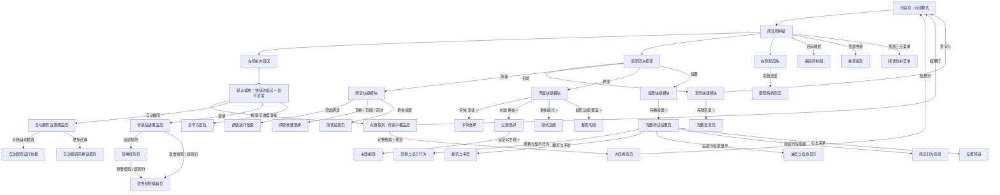
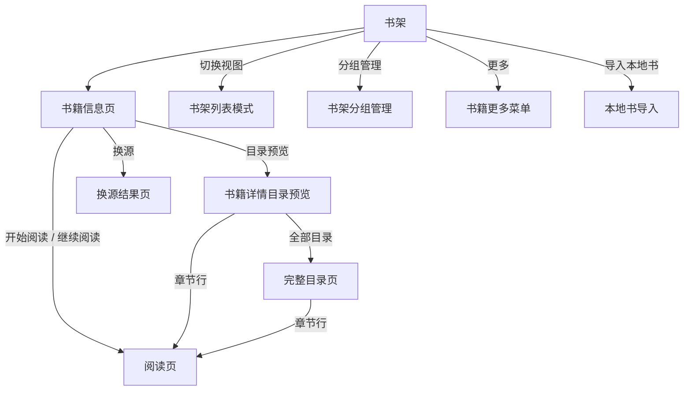
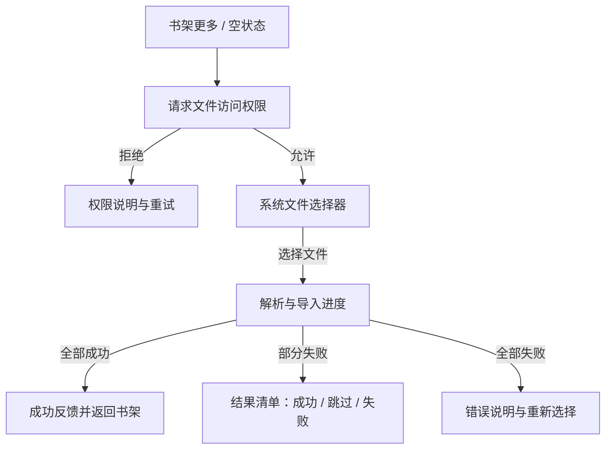
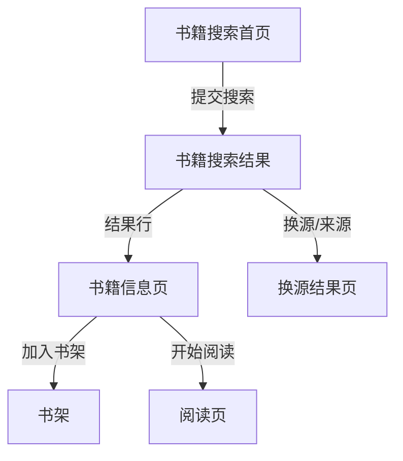
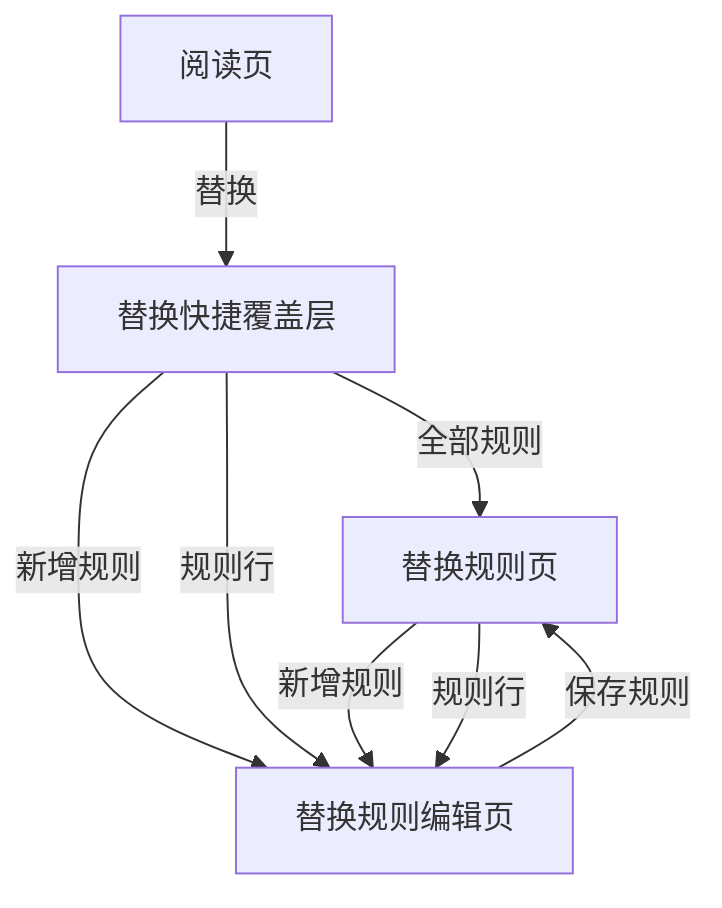
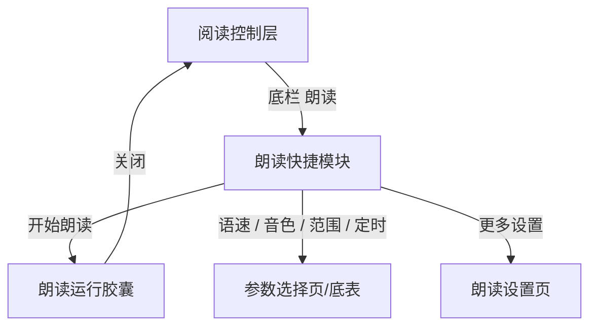
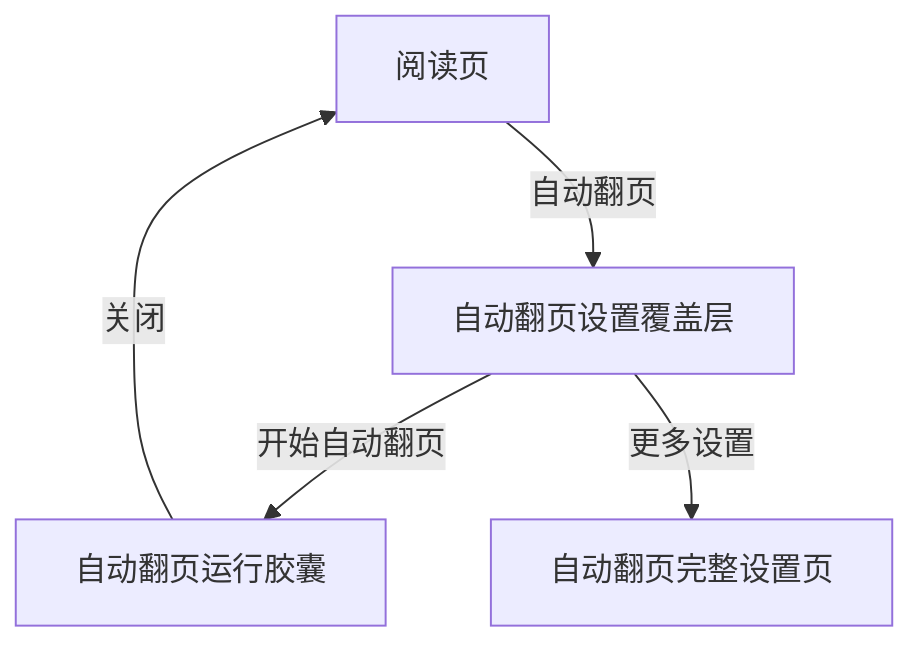
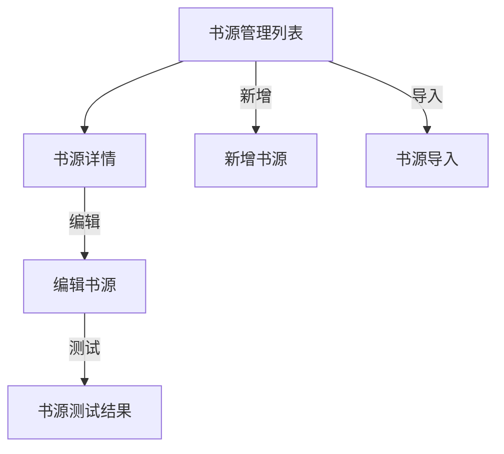
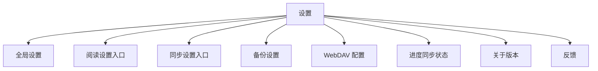

# 页面流程

状态：`REFERENCE_ONLY`
当前权威：全局约束以 `../01-全局规范/00-唯一约束参考.md` 为准；页面交互以各页面包 `10-正式UI设计稿.md` 和 `03-交互规则稿.md` 为准。
说明：本文件为历史流程总览，不定义当前 UI 视觉、页面结构或验收标准。

本文档记录静态截图不容易表达的页面跳转关系。各页面的详细按钮行为仍以对应规格文档中的交互矩阵为准。

阅读控制层的最新动作、互斥、覆盖和返回规则以
`READER_CONTROL_ACTION_FLOWS.md` 为准；本文件只保留全 App 层级的流程总览。

## 阅读控制层

## 书架与书籍详情

`B6 本地书导入` 纳入当前功能范围，但不阻塞 Reader Control Layer freeze。V1 先定义
系统文件选择器入口、存储权限、导入进度、成功/部分失败/失败反馈；专用页面图列入
Bookshelf freeze 的 P1 输入，route 为 `bookshelf_import`（URL `/bookshelf/import`）。

### B6 本地书导入状态

## 书籍搜索

## 内容替换

## 朗读

## 自动翻页

## 书源管理

## 设置与同步

