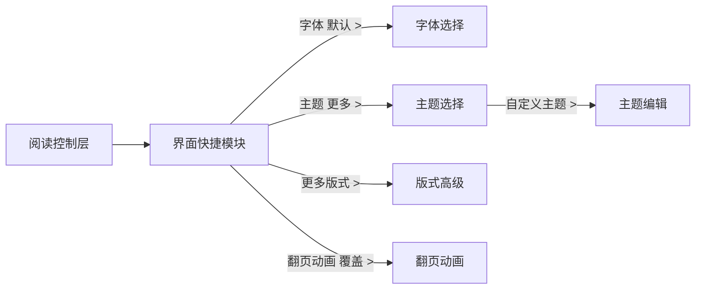

# 阅读界面

> 本文件不再作为阅读控制层结构定义源，最新规格以
> `READER_CONTROL_LAYER_SPEC.md`、`READER_CONTROL_ACTION_FLOWS.md`、
> `READER_CONTROL_RESPONSIVE_RULES.md`、`READER_CONTROL_GEOMETRY_SPEC.md`、
> `READER_CONTROL_IMAGE_USAGE.md` 为准。

相关示意图：

- `../04-阅读链路/阅读外观/图片/01-阅读界面流程示意图.png`
- `../04-阅读链路/阅读外观/图片/02-界面快捷模块旧版.png`
- `../04-阅读链路/阅读外观/图片/04-外观主面板结构参考.png`
- `../04-阅读链路/阅读外观/图片/05-字体选择结构参考.png`
- `../04-阅读链路/阅读外观/图片/06-主题选择结构参考.png`
- `../04-阅读链路/阅读外观/图片/07-主题编辑结构参考.png`
- `../04-阅读链路/阅读外观/图片/08-版式高级结构参考.png`
- `../04-阅读链路/阅读外观/图片/09-翻页动画结构参考.png`
- `../04-阅读链路/阅读外观/图片/11-字体选择标准比例图.png`
- `../04-阅读链路/阅读外观/图片/12-主题选择标准比例图.png`
- `../04-阅读链路/阅读外观/图片/13-主题编辑标准比例图.png`
- `../04-阅读链路/阅读外观/图片/14-版式高级标准比例图.png`
- `../04-阅读链路/阅读外观/图片/15-翻页动画标准比例图.png`
- `../04-阅读链路/阅读外观/图片/16-字体选择管理多状态.png`

其中 `21-reader-appearance-flow.png` 是完整流程总图。`28` 至 `33` 只用于理解
外观设置的信息结构、字段内容和流程拆解，不得用于反推控制层尺寸、底部 sheet 高度、
字体大小、按钮布局或最终视觉基准。
`34-reader-appearance-main-panel-standard.png` 是废弃方案，仅保留历史记录，任何新规格
不得引用它作为界面模块、外观主面板或标准比例依据。
`35` 至 `39` 是完整外观功能页的标准手机比例示例图，用于后续实现参考。
`40` 是字体选择/管理的全屏多状态示意图，用于说明字体数量很多时的搜索、分组、滚动、管理模式、删除和固定预览处理。

## 概念

`界面` 用于调整阅读内容的视觉呈现。它不负责阅读行为、书源、同步、RSS、WebDAV 或朗读行为。

界面分为两层：

- `界面快捷模块`：属于阅读控制层左侧主内容区，承载高频外观调节。
- 完整外观管理页：字体、主题、主题编辑、版式高级和翻页动画等低频选择项。

界面快捷模块必须遵守 `READER_CONTROL_LAYER_SPEC.md`：只替换左侧主内容区，
底部模块导航和右侧亮度栏保持 `04-2` 的基本位置关系。

## 页面流程

## 界面快捷模块

从阅读页底栏 `界面` 打开。

布局：

- 阅读页正文保留在底层。
- 顶部阅读上下文保持可见。
- 只替换阅读控制层左侧主内容区。
- 底部四主按钮保持原位置，并高亮 `界面`。
- 右侧亮度条常驻，不被界面快捷模块覆盖。
- 默认快捷功能区和章节进度区可以被界面快捷模块替换；如需保留章节信息，应作为弱化信息出现在模块内。

内容：

- 标题：`界面`
- 副信息：`阅读外观`
- `文字`
  - `字体 默认 >`
  - `字号 - 18 +`
  - `字距 标准`
- `段落`
  - `行距 紧凑 / 标准 / 舒展`
  - `页边距 窄 / 标准 / 宽`
  - `更多版式 >`
- `主题`
  - 常驻通用主题：`米色 / 白色 / 护眼 / 夜间`
  - `更多 >`
  - 点击常驻主题立即应用。
- `界面`
  - `翻页动画 覆盖 >`
- 正文实时预览。

## 字体选择

从 `字体 默认 >` 进入。

内容：

- 返回按钮
- 当前字体
- 搜索框：`搜索字体`
- 内置字体紧凑选项：`默认 / 系统 / 宋体 / 黑体`
- 导入字体分组，显示数量，例如 `导入字体 · 24`
- 导入入口：`导入`
- 管理入口：`管理`
- 排序入口，例如 `最近使用`
- 底部固定预览栏，展示 `当前字体` 和统一示例段落

规则：

- 字体选择页本身就是全屏管理页，字体数量超出一屏时不再跳转新管理页。
- 超量字体在当前页通过搜索、分组、滚动、排序解决。
- 普通选择状态不直接暴露删除，避免误删。
- 点击 `管理` 进入管理模式，只对导入字体显示删除按钮；内置字体不可删除。
- 预览栏始终固定展示，不提供收起功能。

## 主题选择

从主面板主题区的 `更多 >` 进入。

内容：

- 返回按钮
- 标题：`主题选择`
- 主题卡片：
  - `米色纸张`
  - `纯白`
  - `护眼绿`
  - `灰蓝`
  - `夜间`
- 每张卡片显示背景色、正文字色、小段正文预览和 `应用`。
- 当前选中主题显示勾选图标。
- `自定义主题 >` 进入主题编辑。

## 主题编辑

从 `主题选择` 的 `自定义主题 >` 进入。

内容：

- 返回按钮
- 标题：`主题编辑`
- `主题名称`
- `背景色`
- `正文字色`
- `弱信息色`
- `强调色`
- `背景纹理 无 / 纸张`
- 中文正文预览卡片
- 操作：`取消`、`保存并应用`

## 版式高级

从 `更多版式 >` 进入。

内容：

- `顶部边距`
- `底部边距`
- `左右边距`
- `段距 无 / 标准 / 宽`
- `首行缩进 无 / 2字符`
- `信息位置 四角 / 顶底 / 极简`
- 紧凑预览区

不要在这里重复单双页等行为设置。单双页属于阅读设置。

## 翻页动画

从 `翻页动画 覆盖 >` 进入。

内容：

- `无动画`
- `覆盖`
- `滑动`
- `仿真`
- `滚动`
- 当前选项显示勾选图标
- 小型翻页过渡预览

这里仅控制手动翻页的视觉动画。自动翻页速度和运行方式属于 `自动翻页`。

## 交互矩阵

| 界面元素 | 动作 | 目标 |
| --- | --- | --- |
| 底栏 `界面` | 切换控制层左侧主内容区。 | `界面快捷模块`，亮度条与四主按钮保持原位 |
| `字体 默认 >` | 选择阅读字体。 | `字体选择` |
| `字号 - / +` | 调整字号。 | 当前面板，阅读预览更新 |
| `字距 标准` | 调整字距。 | 当前面板或紧凑选择器 |
| `行距` 分段控件 | 调整行高。 | 当前面板，阅读预览更新 |
| `页边距` 分段控件 | 调整页边距。 | 当前面板，阅读预览更新 |
| 主题色块 `米色/白色/护眼/夜间` | 立即应用通用主题。 | 当前面板，阅读页更新 |
| `主题 更多 >` | 浏览全部主题。 | `主题选择` |
| 主题卡片 `应用` | 应用选中主题。 | 返回上一层并更新主题 |
| `自定义主题 >` | 编辑自定义阅读主题。 | `主题编辑` |
| `保存并应用` | 保存自定义主题并应用。 | `主题选择` 或 `界面快捷模块` |
| `更多版式 >` | 打开低频版式控制。 | `版式高级` |
| `翻页动画 覆盖 >` | 选择手动翻页动画。 | `翻页动画` |

## 不属于界面的内容

- 屏幕方向、屏幕超时、状态栏、音量键翻页、单手翻页：归 `设置`
- 朗读音色、语速、定时、范围：归 `朗读`
- 自动翻页速度、运行方式、停止行为：归 `自动翻页`
- 书源、WebDAV、RSS、全局同步、账号设置：归对应模块或全局设置

## 约束继承

- 唯一全局约束：`../../01-全局规范/00-唯一约束参考.md`
- 文档权威索引：`../../01-全局规范/07-文档权威索引.md`
- 当前 UI 设计图优先定义视觉比例、密度、颜色、圆角、阴影、边距和字号。
- 本目录文字稿定义页面结构、入口、交互、状态、文案和禁止项。
- 未具备完整组件局部和截图叠放验收前，不得标记为 `STITCH_READY` 或 `IMPLEMENTATION_READY`。
