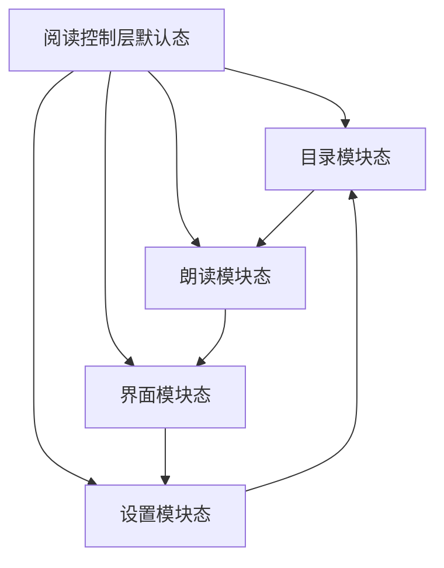

# 阅读控制层动作流规格

本文只定义阅读控制层的交互、状态切换、覆盖与返回规则。结构以
`READER_CONTROL_LAYER_SPEC.md` 为准。

## 一级入口动作矩阵

本矩阵是一级入口动作、信息和返回位置的统一定义。后续分段动作流用于补充细节，
不得与本矩阵冲突。

| 入口 | 页面变化 | 展示信息 | 返回位置 |
| --- | --- | --- | --- |
| 搜索 | 从阅读控制层默认总控态打开内容搜索阅读内浮层。阅读页背景保留并弱化，顶部切换为搜索输入区，底部显示搜索结果 sheet。 | 搜索输入框、清除按钮、命中数量、结果列表、命中片段、章节位置、点击结果跳转提示。搜索范围是当前书籍内容，不是书籍搜索。 | 点击结果后关闭浮层，正文跳转到命中位置并高亮，通常回到沉浸式阅读页；取消搜索则回到阅读控制层默认总控态。 |
| 自动翻页 | 从默认总控态打开自动翻页设置浮层；点击开始后浮层收起，进入沉浸式阅读页并显示自动翻页运行胶囊。 | 设置浮层展示翻页速度、翻页模式、屏幕常亮、到章末行为、取消和开始按钮；运行态胶囊展示自动翻页中、暂停/继续、关闭。 | 取消设置回默认总控态；开始后回沉浸页并显示运行胶囊；关闭胶囊回普通沉浸页；点击胶囊主体可回到自动翻页设置浮层。 |
| 替换 | 从默认总控态打开内容替换快捷浮层。阅读页背景保留并弱化。 | 启用内容替换开关、当前书规则、规则命中数量、规则列表、替换预览、临时关闭、新增规则或全部规则入口。内容替换只影响当前阅读显示，不修改原文。 | 关闭浮层回默认总控态或沉浸页；进入规则管理或规则编辑则进入完整功能页，返回后回替换浮层或控制层。 |
| 目录 | 底部控制层从默认总控态切换为目录模块态，只替换底部控制面板左侧主内容区。顶部控制条、右侧亮度栏、底部模块导航位置保持不变。 | 目录标题、副标题、完整目录入口、目录/书签 Tab、当前卷或回到当前、附近章节列表、当前章节/缓存/书签状态。 | 系统返回键或返回手势优先回默认总控态；点击正文空白关闭控制层回沉浸页；点击完整目录进入完整目录页，返回后回目录模块。 |
| 朗读 | 底部控制层从默认总控态切换为朗读模块态，只替换左侧主内容区。点击开始朗读后收起大面板，进入朗读运行胶囊。 | 朗读模块展示当前章节、当前句、上一句、开始朗读、下一句、语速、音色、范围、定时、试听、朗读设置入口；运行胶囊展示朗读中、暂停/继续、关闭。 | 模块态下系统返回键或返回手势回默认总控态；开始朗读后回沉浸页并显示朗读运行胶囊；点击胶囊主体回朗读模块；关闭胶囊回普通沉浸页。 |
| 界面 | 底部控制层从默认总控态切换为界面模块态，只替换左侧主内容区。不得参考废弃的 `34-reader-appearance-main-panel-standard.png`。 | 字号、行距、字体、主题、翻页动画、预览、更多外观入口。界面模块只管理阅读外观，不管理阅读行为。 | 系统返回键或返回手势回默认总控态；字体选择、主题选择、版式高级、翻页动画进入完整功能页，返回后回界面模块。 |
| 设置 | 底部控制层从默认总控态切换为设置模块态，只替换左侧主内容区。 | 屏幕方向、屏幕超时、隐藏状态栏、音量键翻页、单手翻页、进度信息、完整设置入口。设置模块只管理阅读行为，不管理字体、主题、字号等外观。 | 系统返回键或返回手势回默认总控态；完整设置进入完整阅读设置页，返回后回设置模块。 |
| 换源 | 从顶部控制条打开换源阅读内浮层。进入来源列表后可执行来源检查、检查中、检查结果和切换。 | 当前来源、可用来源列表、来源状态、最新章节、章节数、延迟、检查按钮、切换按钮、检查中进度、检查结果、是否可保留阅读位置。 | 取消回阅读控制层；切换成功后正文重新加载并尽量保留阅读位置，回阅读页或控制层，并显示切换成功反馈。 |
| 更多 | 从顶部控制条右侧打开锚定菜单，不进入完整页面。 | 刷新本章、刷新目录、打开来源页、复制本章链接、书籍缓存、调试信息。每项可有图标、主标题和一行副说明。 | 点击菜单外关闭并回控制层；刷新类动作关闭菜单后显示轻反馈；调试信息打开底部 sheet，关闭后回控制层。 |
| 亮度 | 在控制层右侧亮度栏中直接操作，不打开二级页面。 | 亮度标题、太阳图标、竖向亮度滑杆、A/系统模式、当前亮度状态。 | 调整即时生效并停留在当前控制层状态；系统模式下拖动滑杆切换为手动亮度；点击 A/系统切换跟随系统亮度。 |
| 章节进度 | 在默认总控态的本章进度条上拖动。 | 当前章节标题、本章进度百分比、进度轨道、滑块；拖动时显示百分比或段落位置预览。 | 松手后正文跳转到对应段落，控制层保持展开；取消拖动则回到原阅读位置。 |
| 上一章 | 在默认总控态点击上一章胶囊按钮。 | 显示章节加载轻反馈；加载后更新正文、当前章节标题、章节序号、本章进度。 | 跳转后控制层保持展开，便于连续切章；加载失败时保持当前章并显示错误反馈。 |
| 下一章 | 在默认总控态点击下一章胶囊按钮。 | 显示章节加载轻反馈；加载后更新正文、当前章节标题、章节序号、本章进度。 | 跳转后控制层保持展开，便于连续切章；加载失败时保持当前章并显示错误反馈。 |

## 1. 沉浸页点击热区

透明点击热区不作为显性 UI 绘制。

| 区域 | 建议宽度 | 动作 |
| --- | --- | --- |
| 左侧 | 约 `30%` | 翻上一页 |
| 中间 | 约 `40%` | 显示或隐藏阅读控制层 |
| 右侧 | 约 `30%` | 翻下一页 |

热区不能遮断文字选择、链接、批注等优先级更高的正文交互。

## 2. 控制层开关

控制层出现或消失时，正文不重排。

## 3. 默认态动作

| 入口 | 目标类型 | 目标 |
| --- | --- | --- |
| 搜索 | 专项覆盖层 | 内容搜索覆盖层 |
| 自动翻页 | 专项覆盖层 | 自动翻页配置覆盖层 |
| 替换 | 专项覆盖层 | 内容替换快捷覆盖层 |
| 上一章 / 下一章 | 当前阅读页更新 | 对应章节 |
| 章节进度滑条 | 临时辅助状态 | 章节内位置预览与跳转 |
| 亮度滑条 / 系统 | 控制层内部状态 | 手动亮度或系统亮度 |
| 换源 | 专项覆盖层 | 来源列表、检查与结果 |
| 顶部更多 | 锚定菜单 | 阅读维护菜单 |

## 4. 模块切换

规则：

- 四个模块互斥；
- 点击模块入口只替换左侧主内容区域；
- 再次点击当前模块可保持当前态，是否返回默认态由实现统一决定；
- 顶部控制条、sheet 外壳、亮度栏和模块导航不随切换移动；
- 关闭控制层后再次打开，默认恢复总控态；若产品决定记忆上次模块，需作为独立决策记录。

## 5. 模块内动作

### 5.1 目录

- 章节行：跳转并返回沉浸页；
- 目录/书签：模块内部切换；
- 完整目录：进入完整目录页；
- 搜索或更多：进入目录专项覆盖状态。

### 5.2 朗读

- 开始朗读：收起控制层，进入朗读运行胶囊；
- 语速、音色、范围、定时：打开选择器或轻量底表；
- 朗读设置：进入完整朗读设置页。

### 5.3 界面

- 字号、行距、常用主题：立即更新正文视觉；
- 字体：进入字体选择/管理页；
- 更多主题：进入主题选择；
- 自定义主题：进入主题编辑；
- 版式、翻页动画：进入对应完整功能页。

### 5.4 设置

- 高频选项：在模块内立即切换；
- 完整设置：进入完整阅读设置页；
- 完整设置页不保留亮度栏或底部模块导航。

## 6. 专项浮层互斥

打开内容搜索、自动翻页、替换、换源、目录扩展或朗读扩展时：

- 当前控制层收起或被完整覆盖；
- 不同时显示底部模块导航和右侧亮度栏；
- 返回时回到阅读控制层触发前状态，或按功能结果直接回到沉浸页；
- 同一时间只允许一个专项浮层或菜单存在。

## 7. 运行态

### 自动翻页

配置覆盖层开始运行后，收起控制层，只显示自动翻页运行胶囊。

### 朗读

朗读开始后，收起控制层，只显示朗读运行胶囊。胶囊不显示段落数量。

运行态关闭后返回沉浸页；点击运行胶囊主体可重新打开对应快捷控制。

## 8. 关闭与返回优先级

返回键或返回手势按以下顺序处理：

1. 关闭当前菜单；
2. 关闭当前选择器或确认弹窗；
3. 关闭专项覆盖层；
4. 当前为目录、朗读、界面或设置模块态时，返回阅读控制层默认总控态；
5. 关闭阅读控制层；
6. 离开阅读页。

点击遮罩只关闭最上层可关闭 UI，不穿透触发正文翻页。
