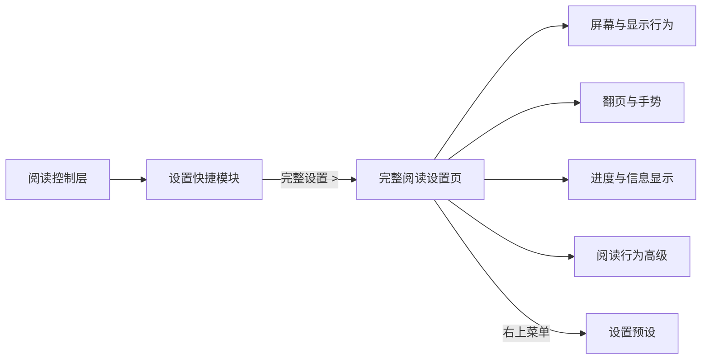

# 阅读设置

> 本文件不再作为阅读控制层结构定义源，最新规格以
> `READER_CONTROL_LAYER_SPEC.md`、`READER_CONTROL_ACTION_FLOWS.md`、
> `READER_CONTROL_RESPONSIVE_RULES.md`、`READER_CONTROL_GEOMETRY_SPEC.md`、
> `READER_CONTROL_IMAGE_USAGE.md` 为准。

相关示意图：

- `../04-阅读链路/阅读设置/图片/01-阅读设置流程示意图.png`
- `../04-阅读链路/阅读设置/图片/03-设置快捷模块高度对齐版.png`

阅读内完整设置首页及其屏幕与显示、翻页与手势、阅读辅助、进度与信息、预设页面的
当前文字定稿以 `MISSING_PAGE_TEXT_SPEC_V1.md` 为准。本文继续负责设置快捷模块的
字段边界和历史信息。

完整阅读设置页的视觉参数以 `SETTINGS_PAGE_DESIGN_SPEC.md` 为准；设置快捷模块仍使用
阅读控制层规格。两者不得互相继承顶部栏、圆角、图标或控件尺寸。

## 概念

`设置` 用于调整阅读行为。它不负责阅读外观、朗读参数、自动翻页运行参数、书源、同步或全局应用设置。

阅读设置分为两层：

- `设置快捷模块`：属于阅读控制层左侧主内容区，只承载高频阅读行为。
- `完整阅读设置页`：离开控制层结构，用于管理屏幕、手势、进度信息、高级行为和预设。

当前校正：

- `docs/ui-design/91-历史归档/drafts/旧全局草稿目录/_rejected/22-1-reader-settings-main-panel.png` 已否决。
- `../04-阅读链路/阅读设置/图片/02-设置快捷模块旧版.png` 是设置快捷模块高度对齐前版本，当前采用 `22-2-reader-settings-quick-panel-height-aligned.png`。
- 否决原因：它把底栏四个主按钮重新放入设置面板底部，破坏了最开始阅读控制层的模块关系。
- 后续结构以 `READER_CONTROL_LAYER_SPEC.md` 为准。
- 设置快捷模块不能重新设计底部四个主按钮的位置，也不能覆盖右侧亮度条。
- 完整阅读设置页应从 `完整设置 >` 进入，不伪装成控制层局部替换。

## 页面流程

## 设置快捷模块

从阅读页底栏 `设置` 打开。

布局：

- 阅读页正文保留在底层。
- 顶部阅读上下文保持可见。
- 只替换阅读控制层左侧主内容区。
- 底部四主按钮保持原位置，并高亮 `设置`。
- 右侧亮度条常驻，不被设置快捷模块覆盖。
- 快捷功能区和章节进度区可以被设置快捷模块替换；如果后续需要保留章节进度，应作为该模块内的弱化信息处理。

内容：

- 标题：`设置`
- 副信息：`阅读行为`
- `完整设置 >`
- `屏幕方向 跟随 / 竖屏 / 横屏`
- `屏幕超时 系统 / 5 分钟 / 常亮`
- `隐藏状态栏`
- `音量键翻页`
- `单手翻页`
- `进度信息`

## 完整阅读设置页

从设置快捷模块的 `完整设置 >` 进入。

布局：

- 独立完整页面或完整管理页。
- 不保留阅读控制层底部四主按钮。
- 不重复右侧亮度滑条。
- 可以使用分组列表、搜索或预设入口管理低频行为。

入口：

- `屏幕与显示行为`
- `翻页与手势`
- `进度与信息显示`
- `阅读行为高级`
- `设置预设`

## 屏幕与显示行为

从完整阅读设置页进入。

内容：

- `屏幕方向 跟随系统 / 竖屏 / 横屏`
- `阅读时保持屏幕常亮`
- `屏幕超时 跟随系统 / 5 分钟 / 10 分钟 / 永不`
- `隐藏状态栏`
- `隐藏导航栏`
- `横屏双页`
- `平板双页策略 自动`

## 翻页与手势

从完整阅读设置页进入。

内容：

- `音量键翻页`
- `音量键方向 上键上一页 / 上键下一页`
- `点击区域 左中右 / 九宫格 / 自定义`
- `单手模式 左手 / 右手 / 自动`
- `滑动翻页`
- `点击翻页`
- `误触保护`
- `长按菜单`

## 进度与信息显示

从完整阅读设置页进入。

内容：

- `控制层章节进度区显示`
- `顶部书名章节`
- `时间电量`
- `章节切换提示`
- 小型预览

这里控制阅读信息的具体样式和可选显示策略。沉浸阅读基线包含左下阅读百分比和
右下章节进度，但不包含贴屏幕底部的额外细进度条。控制层章节进度区和目录上下文
可以提供更详细的进度操作。信息样式和位置归 `界面`。

## 阅读行为高级

从完整阅读设置页进入。

内容：

- `打开书籍后跳转 上次位置 / 章节开头`
- `章节末尾自动进入下一章`
- `换章前确认`
- `阅读进度自动保存频率`
- `断章/空章处理`
- `章节加载失败自动重试`
- `本地缓存优先`
- `隐私阅读模式`

## 设置预设

从完整阅读设置页右上三点菜单进入。

内容：

- `恢复阅读设置默认值`
- `保存当前设置为预设`
- `应用预设`
- `跟随全局阅读设置`
- `仅对当前书籍生效 / 对所有书籍生效`
- 操作：`取消`、`应用`

## 交互矩阵

| 界面元素 | 动作 | 目标 |
| --- | --- | --- |
| 底栏 `设置` | 切换控制层左侧主内容区。 | `设置快捷模块`，亮度条与四主按钮保持原位 |
| `完整设置 >` | 打开完整阅读行为管理。 | `完整阅读设置页` |
| `屏幕方向` | 切换常用屏幕方向。 | 当前快捷模块，阅读页立即更新 |
| `屏幕超时` | 切换常用屏幕超时。 | 当前快捷模块，阅读页立即更新 |
| `隐藏状态栏` | 启用或停用状态栏隐藏。 | 当前快捷模块 |
| `音量键翻页` | 启用或停用音量键翻页。 | 当前快捷模块 |
| `单手翻页` | 启用或停用单手翻页。 | 当前快捷模块 |
| `进度信息` | 启用或停用阅读进度信息。 | 当前快捷模块 |
| 完整页分类入口 | 打开对应低频设置。 | 对应完整设置子页 |
| 完整页右上菜单 | 打开预设和恢复默认操作。 | `设置预设` |

## 不属于设置的内容

- 字体、字号、行距、页边距、主题、翻页动画：归 `界面`
- 朗读音色、语速、定时、范围：归 `朗读`
- 自动翻页速度、自动翻页方式、章末停止：归 `自动翻页`
- 书源、WebDAV、RSS、账号同步：归对应模块或全局设置

## 约束继承

- 唯一全局约束：`../../01-全局规范/00-唯一约束参考.md`
- 文档权威索引：`../../01-全局规范/07-文档权威索引.md`
- 当前 UI 设计图优先定义视觉比例、密度、颜色、圆角、阴影、边距和字号。
- 本目录文字稿定义页面结构、入口、交互、状态、文案和禁止项。
- 未具备完整组件局部和截图叠放验收前，不得标记为 `STITCH_READY` 或 `IMPLEMENTATION_READY`。
