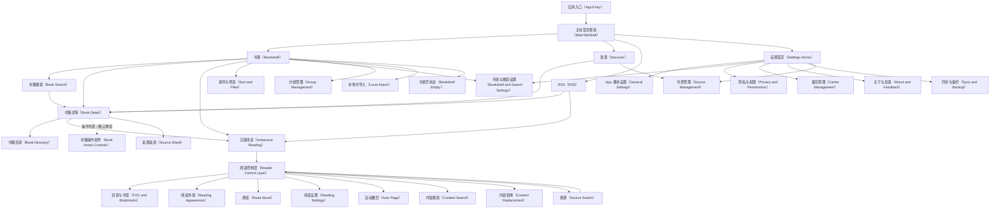

# 页面关系总图（Page Relationship Map）

本文从框架、组件、状态和事件四个层面重新梳理 29 个正式前端输入页面之间的关系。它只描述页面前端架构和交互逻辑，不处理单张 UI 图的视觉细节。

## 信息来源（Source of Truth）

| 来源（Source） | 作用（Purpose） |
|---|---|
| `manifest.json` | 锁定 29 个正式页面、62 个正式验证目标、页面 shell、pageRole、slots 和状态矩阵目标。 |
| `contracts.d.ts` | 锁定每个页面的 Fixture、State union 和 Event union。 |
| `EVENT_CALLBACK_MAPPING.md` | 锁定 Event 到 Compose 回调名的映射，禁止泛化成无语义 `onClick`。 |
| `PAGE_FRAMEWORK_ARCHITECTURE.md` | 锁定 MainTabShell、LibraryShell、ReaderShell、SettingsShell、FlowShell 的结构边界。 |
| `FRAMEWORK_COMPONENT_CATALOG.md` | 锁定组件库、素材库、业务组件和不应组件化内容。 |
| `READER_CONTROL_INTERACTION_MODEL.md` | 锁定阅读控制层入口分级、快捷窗口到完整页的适用范围，以及换源的 FlowShell 规则。 |

## 总体关系（Overall Relationship）



## 页面分层（Page Layers）

| 层级（Layer） | 页面（Pages） | 框架（Shell） | 关系定位（Relationship Role） |
|---|---|---|---|
| 主入口层（Main Entry Layer） | 书架、发现、RSS、设置 | MainTabShell | 四个根 tab，承载应用主导航，负责进入业务链路。 |
| 书架链路层（Library Flow Layer） | 书架空状态、书籍搜索、书籍详情、书籍目录、排序与筛选、分组管理、本地书导入 | LibraryShell | 围绕书籍、书架、目录、导入和分组展开的二级栈；单书操作作为书架管理/书籍详情内的组件或弹层，不形成独立页面。 |
| 阅读链路层（Reader Flow Layer） | 沉浸阅读、阅读控制层、目录与书签、阅读外观、朗读、阅读设置、自动翻页、内容搜索、内容替换 | ReaderShell | 围绕当前书籍、章节、进度和阅读上下文展开的全屏阅读域。 |
| 流程层（Flow Layer） | 换源 | FlowShell | 从阅读中进入的来源检测、候选对照和切换确认流程，保留当前阅读上下文，不进入主导航；手机端仍使用同一应用画布，大屏/横屏可展开为横向对照。 |
| 设置链路层（Settings Flow Layer） | App 通用设置、书架与搜索设置、隐私与权限、缓存管理、关于与反馈、同步与备份、书源管理 | SettingsShell | 从设置首页或业务入口进入的设置栈，承载选项、权限、缓存、备份和书源管理。 |

## Shell 边界（Shell Boundaries）

| 框架（Shell） | 固定内容（Fixed Content） | 可替换内容（Replaceable Content） | 关系规则（Relationship Rule） |
|---|---|---|---|
| MainTabShell | 手机画布、状态栏、顶部栏、内容区、底部四栏导航、状态容器 | 四个主 tab 的内容区 | 主导航切换只替换内容区和 active 状态，不重建二级栈，不进入阅读全屏。 |
| LibraryShell | 返回顶栏、内容区、底部操作宿主、底表宿主、弹窗宿主、状态容器 | 搜索、详情、目录、筛选、导入、分组和操作底表内容 | 保留书籍或书架上下文，状态只替换对应 slot，不替换根框架。 |
| ReaderShell | 阅读正文底层、阅读覆盖层、模块导航、底表宿主、阅读状态容器 | 控制层、目录、外观、朗读、设置、搜索、替换、自动翻页内容 | 所有阅读模块共享当前书籍、章节、进度和阅读配置，不出现主导航。 |
| FlowShell | 流程画布、阅读控制层延续区、候选来源窗口 | 候选来源、当前来源、来源选择状态 | 只用于换源流程；手机端按固定应用画布渲染，大屏可横向展开，进入和返回都必须保留阅读位置。 |
| SettingsShell | 返回顶栏、设置内容区、设置分组、Toast/Dialog/State 宿主 | 通用、书架搜索、权限、缓存、关于、同步、书源内容 | 设置页可以由设置首页或业务入口进入，但必须使用同一设置栈结构。 |

## 主入口关系（Main Entry Relationships）

| 页面（Page） | 核心内容（Core Content） | 主要事件（Primary Events） | 流向（Outbound Relationship） |
|---|---|---|---|
| 书架（Bookshelf） | 分组、继续阅读、我的书架、书籍集合 | `search`、`groupChange`、`read`、`sortFilter`、`settings`、`openBook`、`navChange` | 搜索进入书籍搜索；继续阅读和封面点击直接进入沉浸阅读；书籍详情由长按/更多进入；排序进入排序与筛选；设置进入书架与搜索设置；空集合进入书架空状态。 |
| 发现（Discover） | 书源广场、推荐、榜单、来源筛选 | `searchOpen`、`sourceTypeChange`、`sourceSwitchOpen`、`categoryChange`、`refresh`、`openBookDetail`、`addToBookshelf`、`read`、`sourceDetect`、`rankingMore`、`navChange` | 推荐书进入书籍详情；加入书架回写书架集合；阅读直接进入沉浸阅读；书源相关操作进入书源管理或来源检测流程。 |
| RSS（RSS） | 订阅概览、订阅流、未读状态 | `searchOpen`、`refresh`、`statusFilterChange`、`sourceFilterChange`、`openEntry`、`entryMoreOpen`、`addSubscription`、`retry`、`navChange` | 条目进入详情或沉浸阅读；订阅管理进入书源管理或设置链路；刷新只更新当前内容区。 |
| 设置首页（Settings Home） | 设置入口、概览、权限和备份提示 | `search`、`more`、`quickEntry`、`openSetting`、`navChange` | 进入 7 个 SettingsShell 二级页；主导航仍只在 MainTabShell 内切换。 |

## 书架链路关系（Library Flow Relationships）

| 页面（Page） | 进入来源（Entry From） | 主要事件（Primary Events） | 后续流向（Next Relationship） |
|---|---|---|---|
| 书架空状态（Bookshelf Empty） | 书架无书、筛选无书、离线或权限状态 | `search`、`groupChange`、`primaryAction`、`secondaryAction`、`navChange` | 进入书籍搜索、本地书导入或发现；状态仍保留 MainTab/Library 上下文。 |
| 书籍搜索（Book Search） | 书架搜索、空态导入前搜索、发现搜索 | `queryChange`、`scopeChange`、`groupChange`、`historySelect`、`submitSearch`、`openDetail`、`addToBookshelf`、`read`、`retry`、`requestPermission` | 结果进入书籍详情；加入书架回写书架；阅读直接进入沉浸阅读。 |
| 书籍详情（Book Detail） | 书架书籍、搜索结果、发现推荐、RSS 条目 | `sourceSheetOpen`、`sourceRefresh`、`sourceSelect`、`sourceConfirm`、`read`、`addToBookshelf`、`openDirectory`、`openChapter`、`introExpand`、`retry` | 开始阅读直接进入沉浸阅读；目录进入书籍目录；来源选择在当前 LibraryShell 的 sheet/dialog host 内完成。 |
| 书籍目录（Book Directory） | 书籍详情、阅读目录跳转 | `openCurrentChapter`、`openChapter`、`retry`、`backToDetail` | 章节进入沉浸阅读；返回书籍详情。 |
| 排序与筛选（Sort and Filter） | 书架标题操作、分组筛选入口 | `sortSelect`、`orderSelect`、`filterToggle`、`reset`、`apply`、`retry` | 应作为底表或二级筛选层回写书架列表，不独立改变主导航。 |
| 书籍操作组件（Book Action Controls） | 书架管理态、书籍详情页、书籍长按浮层 | `edit`、`moveGroup`、`deleteRequest`、`deleteCancel`、`deleteConfirm`、`deleteRetry` | 不作为页面路由；在来源页面内以列表、底表或确认弹窗集成。编辑/分组保留来源页上下文，危险操作必须走 ConfirmDialog。 |
| 分组管理（Group Management） | 书架分组设置、书架设置 | `addGroupOpen`、`groupRenameOpen`、`groupDeleteOpen`、`groupReorder`、`dialogSave`、`deleteConfirm`、`retry` | 回写书架分组；新建、重命名、删除通过 DialogHost 承载。 |
| 本地书导入（Local Import） | 空书架、书架更多、本地导入入口 | `openSystemFilePicker`、`pickerCancelled`、`importProgress`、`resultRowOpen`、`chooseAgain`、`done`、`backToBookshelf` | 导入成功回到书架；失败保留导入结果和重试入口。 |

## 阅读链路关系（Reader Flow Relationships）

| 页面（Page） | 进入来源（Entry From） | 主要事件（Primary Events） | 后续流向（Next Relationship） |
|---|---|---|---|
| 沉浸阅读（Immersive Reading） | 书架继续阅读、封面点击、详情开始阅读、章节跳转、缓存继续 | `tapPrevious`、`tapCenter`、`tapNext`、`retry`、`continueCached`、`backToSource` | 中心点击打开阅读控制层；左右点击翻页；打开/失败/离线状态归入 ReaderStateHost，不形成独立页面。 |
| 阅读控制层（Reader Control Layer） | 沉浸阅读中心点击、阅读模块返回 | `sourceChange`、`quickAction`、`chapterChange`、`progressChange`、`moduleChange`、`bottomSheetDrag`、`brightnessChange`、`dismissControlLayer` | 目录/朗读/界面/设置先打开快捷控制窗；底栏顶部小横条点击或上拉展开为完整控制页；换源先打开阅读内快捷窗，完整来源对照进入 FlowShell；正文中部点击隐藏控制层回沉浸阅读。 |
| 目录与书签（TOC and Bookmarks） | 阅读控制层目录模块 | `tabChange`、`openFullDirectory`、`openChapter`、`openBookmark`、`moduleChange`、`brightnessChange` | 当前 demo 的目录行只显示章节名；打开章节直接回沉浸阅读并定位章节；书签 tab 可显示书签摘要；模块切换仍留在 ReaderShell。 |
| 阅读外观（Reading Appearance） | 阅读控制层界面模块 | `fontSizeDecrease`、`fontSizeIncrease`、`lineHeightChange`、`paragraphGapChange`、`letterSpacingChange`、`themeChange`、`fontChange`、`moduleChange` | 当前 demo 使用纯色主题色块，色块内不放图标；字号、行距、段距、字距以两列参数组即时改变 ReadingSurface；不离开 ReaderShell。 |
| 朗读（Read Aloud） | 阅读控制层朗读模块 | `startReadAloud`、`pauseReadAloud`、`previousSentence`、`nextSentence`、`speedChange`、`voiceChange`、`timerChange`、`rangeChange`、`openReadAloudSettings` | 当前 demo 不展示示例正文；中间开始/暂停按钮只显示图标；语速、音色、范围、定时可在模块内循环切换；设置入口进入阅读设置子页。 |
| 阅读设置（Reading Settings） | 阅读控制层设置模块、朗读设置入口 | `toggleSetting`、`cycleTapMode`、`openMoreReaderSettings` | 当前 demo 使用自动翻页、音量键翻页、横屏锁定、屏幕常亮开关，以及点击翻页方式循环值；只影响阅读行为和阅读控件状态，不进入 SettingsShell。 |
| 自动翻页（Auto Page） | 阅读控制层快捷操作 | `speedChange`、`modeChange`、`toggleOption`、`startAutoPage`、`pauseAutoPage`、`continueAutoPage`、`stopAutoPage` | 启停自动翻页并返回沉浸阅读或保留控制层。 |
| 内容搜索（Content Search） | 阅读控制层快捷操作 | `queryChange`、`clear`、`filterChange`、`previousResult`、`nextResult`、`openResult`、`retry` | 打开结果定位到当前书籍正文，不离开 ReaderShell。 |
| 内容替换（Content Replacement） | 阅读控制层快捷操作 | `toggleReplacement`、`toggleRule`、`openRule`、`addRule`、`patternChange`、`replacementChange`、`testReplacement`、`saveRule`、`temporaryClose` | 保存替换规则并影响当前阅读正文渲染，不进入设置链路。 |

## 阅读控制层入口分级（Reader Control Entry Tiers）

阅读控制层不是把所有按钮都做成同一种页面跳转。入口必须按操作复杂度分为即时动作、快捷控制窗、完整控制页和流程页四类。快捷控制窗和完整控制页通过底栏顶部小横条建立父子关系，而不是通过页面路由硬跳转。

| 入口级别（Entry Tier） | 适用交互（Applicable Interactions） | 首次点击结果（First Click Result） | 深层入口（Deep Entry） | 返回规则（Return Rule） |
|---|---|---|---|---|
| 即时动作（Immediate Action） | 上一页、下一页、隐藏控制层、退出阅读、亮度拖动、章节进度拖动 | 直接改变 ReaderShell 运行态，不弹窗，不换页 | 无 | 保持当前 ReaderContext，只更新页码、进度、亮度或显示状态。 |
| 快捷控制窗（Quick Window） | 目录、朗读、界面、设置、搜索、自动翻页、替换、换源 | 在正文可用区打开短窗口，只承载当前任务 P0 操作，底栏和四按钮保持原位 | 点击或上拉底栏顶部小横条展开对应完整控制页；换源完整流程进入 FlowShell | 重复点击当前 active 模块关闭快捷窗；点击其他模块直接替换快捷窗内容；正文中部关闭控制层。 |
| 完整控制页（Full Control Sheet） | 目录与书签、朗读、阅读外观、阅读设置、内容搜索、自动翻页、内容替换 | 由底栏上拉展开，覆盖正文大部分区域，但不重建 ReadingSurface | 完整配置、全量列表、规则编辑、预设和高级选项 | 下拉小横条先折叠回快捷窗；系统返回先折叠，再关闭快捷窗。 |
| 流程页（Flow Page） | 换源完整流程 | 从换源快捷窗或来源入口进入 `FlowShell` | 来源对照、失败原因、重试检测、切换确认；书源维护仍归 SettingsShell | 成功或取消都回 ReaderShell，并保留书籍、章节、进度。 |

### 快捷控制窗到完整控制页规则（Quick Window to Full Control Page Rules）

| 交互内容（Interaction） | 快捷控制窗必须包含（Quick Window Must Include） | 完整控制页承担（Full Page Owns） | 展开方式（Expansion） |
|---|---|---|---|
| 目录与书签（TOC and Bookmarks） | 当前章节附近 6-8 行；目录行只显示章节名；书签 tab 显示标题和位置。 | 完整目录、书签列表、目录搜索、章节定位和更多菜单。 | 底栏小横条上拉。 |
| 朗读（Read Aloud） | 开始/暂停图标按钮、上一句/下一句、语速、声音、范围、定时；不展示示例正文。 | 声音管理、朗读引擎、后台朗读、定时策略和高级设置。 | 底栏小横条上拉。 |
| 阅读外观（Reading Appearance） | 纯色主题色块、字号、行距、段距、字距、字体，并即时预览正文；主题色块内不放图标。 | 自定义主题、字体管理、页边距、翻页动画和完整排版设置。 | 底栏小横条上拉。 |
| 阅读设置（Reading Settings） | 自动翻页、点击翻页方式、屏幕常亮、音量键翻页、横屏锁定。 | 分组设置、预设应用、恢复默认和更多阅读行为配置。 | 底栏小横条上拉。 |
| 内容搜索（Content Search） | 当前书内输入框、上一条/下一条、少量结果预览。 | 全量结果列表、筛选范围、键盘避让和结果定位。 | 底栏小横条上拉。 |
| 自动翻页（Auto Page） | 速度、模式、开始/暂停。 | 运行状态、退出路径、模式详情、停止策略和高级选项。 | 底栏小横条上拉。 |
| 内容替换（Content Replacement） | 总开关、最近规则、当前命中数、新增入口。 | 规则编辑、测试结果、生效范围和持久化保存。 | 底栏小横条上拉。 |
| 换源（Source Switch） | 当前来源、按延迟排序的候选来源；每行只显示书源名、延迟和最新章节。 | 来源对照、失败原因、重试检测、切换确认和返回阅读上下文；书源编辑仍归 SettingsShell。 | 换源窗口进入 FlowShell，不使用 SettingsShell。 |

### 换源决策（Source Switch Decision）

换源不是阅读设置模块，但要遵守同一套“短窗口先处理，复杂流程再展开”的关系。换源从阅读控制层顶部栏进入后，先在正文可用区域打开换源快捷窗口；需要完整来源对照时进入 `FlowShell`，因为它需要同时保留阅读控制层上下文和来源流程上下文。

换源的固定结构如下：

```text
ReaderShell
└─ ReaderTopBar.sourceChange
   ├─ ReaderShell.SourceQuickWindow
   │  └─ 正文区域内换源快捷窗口；候选源每条两行：书源名 + 延迟 / 最新章节
   └─ FlowShell.SourceSwitch
      ├─ StepRegion             延续进入前的阅读控制层：顶部栏、正文、底部控制面板、亮度栏和四模块导航
      └─ ComparisonRegion       完整来源对照与切换确认
```

换源行为规则：

- 候选源默认按延迟从小到大排序；离线、超时等无延迟状态排在有延迟来源之后。
- 换源窗口位置必须保持在正文可用区域，不与顶部阅读栏、底部控制面板、亮度栏或四模块导航重叠。
- 换源窗口样式必须沿用阅读控制层面板，不使用暗色遮罩、独立模态阴影或蓝色高亮聚焦。
- 不展示筛选、检测条、结果保存面板或底部状态摘要。
- 候选源行点击只改变当前候选；真实实现可以按业务要求决定点击即切源或点击后返回阅读。
- 切源时更新 `SourceContext.sourceId`，保留 `ReaderContext.bookId / chapterId / progress`，再返回阅读控制层或沉浸阅读。
- 关闭或返回不更新来源，只恢复进入换源前的 ReaderShell 状态。
- 书源管理、书源编辑、批量检测属于 `SettingsShell` 的书源管理，不塞进阅读中的换源窗口。
- 手机端 FlowShell 必须和其他应用页面保持同一画布尺寸；大屏或横屏设备才可以展开候选来源窗口。

## 横向流程关系（Flow Relationship）

| 页面（Page） | 进入来源（Entry From） | 主要事件（Primary Events） | 后续流向（Next Relationship） |
|---|---|---|---|
| 换源（Source Switch） | 阅读控制层 `sourceChange`、阅读打开失败修复、书籍详情来源选择确认后的阅读中换源 | `backToReading`、`switchSource`、`retry`、`grantPermission` | 成功切源回到 ReaderShell 并保留书籍、章节、进度；取消回到阅读控制层或沉浸阅读；手机端不改变应用画布尺寸，不展示筛选、结果面板或底部状态摘要。 |

## 设置链路关系（Settings Flow Relationships）

| 页面（Page） | 进入来源（Entry From） | 主要事件（Primary Events） | 后续流向（Next Relationship） |
|---|---|---|---|
| App 通用设置（General Settings） | 设置首页 | `themeChange`、`selectOpen`、`selectOption`、`switchChange`、`restoreOpen`、`restoreConfirm`、`retry`、`openSystemSettings` | 选项底表、恢复确认、系统设置入口，仍在 SettingsShell。 |
| 书架与搜索设置（Bookshelf and Search Settings） | 设置首页、书架设置入口 | `layoutChange`、`columnCountChange`、`selectOpen`、`selectOption`、`switchChange`、`clearHistoryOpen`、`clearHistoryConfirm`、`retry`、`openSystemSettings` | 回写书架布局、列数、搜索历史策略；危险操作走 ConfirmDialog。 |
| 隐私与权限（Privacy and Permissions） | 设置首页、权限状态入口 | `openSystemSettings`、`togglePrivacyOption`、`openPrivacyPolicy`、`clearPrivacyDataOpen`、`clearPrivacyDataCancel`、`clearPrivacyDataConfirm`、`retry` | 系统设置或确认弹窗，保留 SettingsShell。 |
| 缓存管理（Cache Management） | 设置首页、阅读缓存入口 | `calculateCache`、`openCleanupConfirm`、`cleanupCancel`、`cleanupConfirm`、`toggleCacheStrategy`、`openCacheLocation`、`retry` | 缓存计算、清理确认和缓存策略切换。 |
| 关于与反馈（About and Feedback） | 设置首页 | `checkUpdate`、`openFeedback`、`openSuggestion`、`openLicense`、`openPrivacyPolicy`、`openHelp`、`retry` | 外部链接、反馈入口或离线错误状态。 |
| 同步与备份（Sync and Backup） | 设置首页、备份提示入口 | `selectBackupLocation`、`runBackupNow`、`exportBackup`、`restoreBackup`、`restoreCancel`、`restoreConfirm`、`toggleAutoBackup`、`openWebDavSettings`、`resolveConflict`、`retry`、`grantPermission` | 备份、恢复、冲突解决和权限入口。 |
| 书源管理（Source Management） | 设置首页、发现来源入口、RSS 订阅入口 | `queryChange`、`groupFilterChange`、`toggleSource`、`detectSource`、`detectAll`、`openSourceDetail`、`openSourceEdit`、`addSource`、`saveSource`、`openLog`、`retry` | 管理书源、检测书源、编辑书源和查看日志；不作为主导航 tab。 |

## 共享组件关系（Shared Component Relationships）

| 组件族（Component Family） | 主要组件（Main Components） | 页面关系（Page Relationship） |
|---|---|---|
| 基础控件（Primitive Components） | IconButton、SearchBar、Chip、SegmentControl、Switch、TextField、ProgressBar、ProgressSlider、PrimaryActionButton、SecondaryActionButton | 跨所有 shell 复用；事件必须映射到页面 Event union。 |
| 书籍组件（Product Book Components） | BookCover、BookCard、BookRow、BookSummary、BookDetailHeader、ChapterRow、CurrentChapterRow、SearchResultItem | 连接 MainTabShell、LibraryShell 和 ReaderShell，是书架、搜索、详情、目录、沉浸阅读之间传递上下文的核心。 |
| 阅读组件（Reader Components） | ReadingSurface、ReaderTopBar、ReaderModuleNav、QuickAction、ReaderPanel、TocPanel、AppearancePanel、TTSPanel、BrightnessSlider | 只属于 ReaderShell 和 FlowShell 上下文，不能被主标签页或普通详情页复制成独立布局。 |
| 设置组件（Settings Components） | SettingGroupCard、SettingRow、SelectRow、OptionSheet、DangerActionRow、PermissionRow、CacheSizeCard、VersionCard、BackupRecordRow、SourceRow | SettingsShell 内复用；阅读设置属于 ReaderShell，不直接复用完整 SettingsShell 页面。 |
| 弹层与状态（Sheets and States） | BottomSheet、ConfirmDialog、LoadingState、EmptyState、ErrorState、PermissionState、ToastHost、StateHost | 只替换所属 shell 的宿主 slot，不替换根框架、主导航或阅读正文底层。 |

## 上下文传递（Context Passing）

| 上下文（Context） | 创建位置（Created At） | 传递路径（Transfer Path） | 不可丢失字段（Must Preserve） |
|---|---|---|---|
| 主导航上下文（Main Nav Context） | MainTabShell | 书架、发现、RSS、设置之间切换 | 当前 tab、各 tab 滚动位置、加载/空态/错误状态。 |
| 书籍上下文（Book Context） | 书架、发现、RSS、搜索 | 书籍详情、目录、沉浸阅读、操作底表 | bookId、title、author、cover、source、chapter、progress。 |
| 书架上下文（Library Context） | 书架 | 分组、排序、筛选、分组管理、本地导入 | group、sort、filter、layout、selectedBook。 |
| 阅读上下文（Reader Context） | 沉浸阅读 | 控制层、模块面板、换源 | bookId、chapterId、progress、sourceId、appearance、ttsState。 |
| 设置上下文（Settings Context） | 设置首页或业务入口 | 设置二级页、选项底表、确认弹窗 | settingKey、currentValue、pendingValue、permissionState。 |
| 来源上下文（Source Context） | 发现、书源管理、阅读换源 | SourceManagement、SourceSwitch、BookDetail source sheet | sourceId、sourceStatus、candidateList、detectResult。 |

## 导航栈规则（Navigation Stack Rules）

| 栈（Stack） | 入栈（Push） | 出栈（Pop） | 上下文恢复（Context Restore） |
|---|---|---|---|
| MainTab root | 应用启动或主导航切换。 | 不作为普通二级页弹出。 | 每个 tab 保留自己的滚动、筛选和状态。 |
| Library stack | 搜索、详情、目录、筛选、分组、导入从书架 / 发现 / RSS 入栈。 | 返回来源页或来源 tab。 | 恢复 LibraryContext 和 BookContext。 |
| Reader stack | 打开书籍或章节后直接进入沉浸阅读，打开/失败/离线状态归入 ReaderStateHost。 | 关闭控制层回沉浸阅读，退出阅读回来源。 | 恢复 ReaderContext。 |
| Flow stack | 换源从 ReaderShell 进入。 | 成功、取消、失败均回 ReaderShell。 | 恢复 ReaderContext，并按选中来源更新 SourceContext；手机端 FlowShell 不改变页面画布尺寸。 |
| Settings stack | 设置首页或业务入口进入二级设置页。 | 返回设置首页或业务来源。 | 恢复 SettingsContext 和来源入口。 |
| Overlay stack | Dialog、Sheet、Reader panel、Keyboard 属于当前 shell 的覆盖栈。 | 按 Dialog > Sheet / panel > Page 顺序关闭。 | 关闭覆盖层不丢页面上下文。 |

## 状态替换规则（State Replacement Rules）

| 状态（State） | 替换范围（Replacement Scope） | 禁止行为（Forbidden Behavior） |
|---|---|---|
| Loading | 当前内容 slot 或局部列表区域。 | 不替换根 Shell、顶栏、主导航或 ReaderShell 正文底层。 |
| Empty | 当前内容区或 StateHost。 | 不遮挡主动作和返回路径。 |
| Error | 当前内容区、局部卡片或 ReaderStateHost。 | 不清空上下文字段。 |
| Offline | 当前内容区或局部状态卡。 | 不阻断可用缓存和返回路径。 |
| Permission | StateHost 或 DialogHost。 | 不把系统权限边界伪装成普通页面。 |
| Partial Loading | 列表行、卡片或局部区域。 | 不替换整页。 |
| Sync Conflict | 同步与备份内容区或 DialogHost。 | 不自动覆盖本地数据。 |

## 交互约束（Interaction Constraints）

- 主标签页切换只影响 MainTabShell 的内容区和导航 active，不重建二级页面栈。
- 书架页的核心内容是书籍集合；继续阅读是快捷入口，不能主导页面结构。
- 书籍详情、目录、操作底表必须共享同一书籍上下文。
- 阅读链路必须从 ReaderShell 组织，不能把阅读控制层当成 LibraryShell 详情页。
- 阅读控制层四个模块按钮点击后只改变背景、图标颜色和文字颜色，尺寸、间距、相对位置不变；重复点击当前 active 模块关闭快捷控制窗；点击底栏顶部小横条或上拉底栏展开完整控制页。
- FlowShell 的换源是流程型页面，从阅读中进入，返回阅读中，不进入主导航；手机端不放大画布，大屏/横屏才横向展开。
- 设置页可以由设置首页或业务页面入口进入，但所有设置二级页必须使用 SettingsShell。
- Loading、Empty、Error、Permission 只能替换所属内容 slot 或 state host，不能替换 shell 根框架。
- 底表和弹窗必须挂在所属 shell 的 host 下，不允许页面内临时复制宿主。

## 后续实现顺序（Implementation Order）

1. 先把 `contracts.d.ts` 的 State/Event 映射为 Android UI state 和明确回调。
2. 再按 MainTabShell 固定四个根入口，保留每个 tab 的局部状态。
3. 优先把书架页做成真实状态驱动页面：分组、继续阅读、书籍集合、排序、设置、打开书籍、进入阅读。
4. 然后串联 LibraryShell：搜索、详情、目录、操作底表、分组管理、本地导入。
5. 再串联 ReaderShell：沉浸阅读、控制层、目录、外观、朗读、设置、搜索、替换、自动翻页。
6. 最后固化 FlowShell 和 SettingsShell 的跨入口关系，确保来源、权限、缓存、备份等上下文不丢失。
