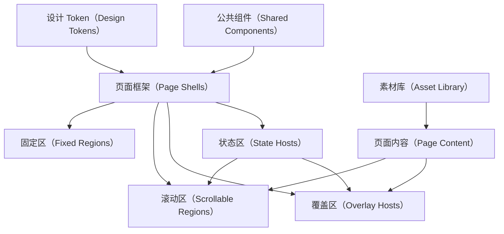

# 应用页面结构图（Application Page Structure Map）

本文按应用页面的框架结构重新梳理 UI 设计稿。所有 UI 设计图都视为真实应用页面或页面状态，不视为示例图、展示图或静态海报。

## 梳理口径（Structure Rule）

- 先框架（Shell First）：先确认页面属于 MainTabShell、LibraryShell、ReaderShell、FlowShell 或 SettingsShell。
- 再槽位（Slots Second）：再确认固定槽位、内容槽位、滚动槽位、覆盖槽位和状态槽位。
- 后内容（Content Last）：最后才看页面业务内容，例如书籍、章节、设置项、来源候选。
- 状态不换壳（State Does Not Replace Shell）：加载、空、错误、权限状态只能替换内容区或状态宿主，不能替换根框架。
- 截图只作证据（Screenshot As Evidence）：UI 图用于校准结构和视觉，不作为前端页面架构本身。

## 全局页面结构（Global Page Structure）



## 框架组件间结构关系（Shell Component Structure Relations）

框架组件之间不是简单的纵向堆叠关系。每个 shell 都必须同时说明父子关系、层级关系、滚动归属和遮挡规则。

### 层级顺序（Layer Order）

| 层级（Layer） | 主标签页（MainTabShell） | 书架链路（LibraryShell） | 阅读器（ReaderShell） | 流程页（FlowShell） | 设置页（SettingsShell） |
|---:|---|---|---|---|---|
| 0 | `appFrame` 背景 | `stackFrame` 背景 | `readerFrame` 背景 | `flowFrame` 背景 | `settingsFrame` 背景 |
| 10 | `contentRegion` 正式内容滚动层 | `contentRegion` 正式内容滚动层 | `readingSurface` 正文底层 | `stepRegion / comparisonRegion / resultRegion` | `settingsContent` 正式内容滚动层 |
| 20 | `stateHost` 内容状态层 | `bottomActionHost` 底部操作层 | `readerOverlayHost` 阅读覆盖层 | `stateHost` 流程状态层 | `settingsStateHost` 设置状态层 |
| 30 | `mainNav` 悬浮主导航层 | `sheetHost` 底表层 | `bottomSheetHost` 阅读面板层 | 无通用浮层 | `toastHost` 提示层 |
| 40 | 全局弹层或系统浮层 | `dialogHost` 弹窗层 | `readerModuleNav` 模块导航层 | 全局弹层或系统浮层 | `dialogHost` 弹窗层 |

### 主标签页层级（MainTabShell Layering）

`MainTabShell` 的底部主导航不是 `contentRegion` 的一部分，也不是普通列表尾部。它是悬浮在正式内容上方的固定层。

```text
AppFrame
├─ StatusBar                 顶部固定占位
├─ AppTopBar                 顶部固定占位
├─ ContentRegion             正式内容滚动层，延伸到 MainNav 下方
│  └─ ScrollContent          书架、发现、RSS、设置内容
├─ StateHost                 内容状态层，不能盖住 MainNav 的 active 状态
└─ MainNav                   底部悬浮层，覆盖 ContentRegion 底部
```

主导航结构规则：

- `MainNav` 必须浮在 `ContentRegion` 上方，视觉上可以覆盖内容底部。
- `ContentRegion` 必须有底部内容 inset，至少等于 `MainNav` 高度加安全区。
- 列表、网格、设置入口等正式内容必须能滚动到 `MainNav` 上方完整可见。
- 被 `MainNav` 覆盖的只能是可滚动过渡区，不能是必须点击的最后一个完整项目。
- `MainNav` 的 active 反馈只改变背景、中心图标颜色和文字颜色，不改变按钮尺寸、间距和相对位置。

### 书架链路层级（LibraryShell Layering）

`LibraryShell` 的返回顶栏和底部操作区是框架层；底表和弹窗是覆盖层。

- `BackTopBar` 固定在内容上方，不随内容滚动消失。
- `ContentRegion` 是二级页正式内容滚动层。
- `BottomActionHost` 如果存在，浮在内容底部；内容区必须保留底部 inset。
- `SheetHost` 覆盖当前二级页内容和底部操作，但不替换 `stackFrame`。
- `DialogHost` 高于 `SheetHost`，用于确认、删除、命名等阻塞式操作。

### 阅读器层级（ReaderShell Layering）

`ReaderShell` 的核心关系是正文底层和控制覆盖层的叠放。

- `ReadingSurface` 是底层正文，承载正文、页脚进度、点击热区和阅读位置。
- `ReaderOverlayHost` 浮在正文上方，承载顶部阅读栏、亮度栏、快捷操作。
- `BottomSheetHost` 浮在 overlay 内，用于目录、外观、朗读、设置、搜索、替换等面板。
- `ReaderModuleNav` 是阅读模块导航固定层，不能挤压正文布局，也不能改变按钮位置来表达 active；重复点击当前 active 模块必须关闭模块面板并回到默认阅读控制层。
- 当前 demo 的模块面板细节以运行态为准：目录行只显示章节名；朗读开始按钮只显示图标且不展示示例正文；界面主题色块为无图标纯色块；界面参数以两列组展示字号、行距、段距、字距；阅读设置开关和值项在模块内即时切换。
- `ReaderStateHost` 可以表达打开失败、离线、加载，但必须保留回到来源或继续缓存入口。

### 设置页层级（SettingsShell Layering）

`SettingsShell` 的设置内容滚动，提示和弹窗覆盖。

- `BackTopBar` 固定在设置内容上方。
- `SettingsContent` 是唯一正式内容滚动层。
- `ToastHost` 浮在内容之上，但不能改变设置行布局。
- `DialogHost` 高于 Toast，用于清空、恢复、权限等确认。
- `SettingsStateHost` 只替换状态区域，不替换返回顶栏。

## 组件覆盖关系矩阵（Component Overlay Matrix）

覆盖关系必须按组件职责定义，不能靠视觉截图临时判断。下表中的“可覆盖”表示允许出现在目标组件上方；“不可覆盖”表示必须通过 inset、避让、重新分层或转入更高宿主解决。

| 覆盖组件（Overlay Component） | 可覆盖对象（Can Cover） | 不可覆盖对象（Must Not Cover） | 必须保留（Must Preserve） |
|---|---|---|---|
| `StatusBar` | 页面背景。 | 顶部业务按钮、返回按钮、正文第一行。 | 顶部安全区和系统状态可读性。 |
| `AppTopBar` | `ContentRegion` 顶部滚动内容。 | `StatusBar`、`MainNav`、弹窗确认动作。 | 页面标题、搜索、更多等顶栏事件。 |
| `BackTopBar` | `ContentRegion` 顶部滚动内容。 | 返回按钮自身、系统状态栏、阻塞弹窗。 | 返回路径和当前二级页标题。 |
| `MainNav` | `ContentRegion` 底部过渡区。 | 最后一项完整可点击内容、阻塞弹窗、系统键盘。 | 四个 tab 的 active 状态、按钮尺寸和相对位置。 |
| `BottomActionHost` | `ContentRegion` 底部过渡区。 | 最后一项必须点击内容、`SheetHost`、`DialogHost`。 | 当前页面主操作和内容底部 inset。 |
| `StateHost` | 所属 shell 的内容区或状态区域。 | 根 shell、顶栏、主导航、返回导航、弹窗确认动作。 | 重试、替代入口、权限入口或返回路径。 |
| `SettingsStateHost` | `SettingsContent` 内状态区域。 | `BackTopBar`、`DialogHost`、`ToastHost`。 | 设置页返回和当前设置上下文。 |
| `ReaderStateHost` | `ReadingSurface` 或阅读状态区域。 | 阅读返回入口、来源入口、阻塞弹窗。 | bookId、chapterId、progress、缓存继续入口。 |
| `SheetHost` / `BottomSheet` | 当前 shell 内容区、底部操作区。 | `DialogHost`、系统键盘、必须保留的返回路径。 | 来源页面上下文、关闭动作、底表主操作。 |
| `BottomSheetHost` | `ReadingSurface` 下半区、阅读快捷操作区。 | `ReaderModuleNav` 稳定位置、阻塞弹窗。 | 当前阅读正文状态和模块 active 状态。 |
| `DialogHost` / `ConfirmDialog` | 当前 shell 内容、底表、toast、主导航视觉层。 | 系统权限弹窗、系统键盘确认输入。 | 明确结果文案、取消动作、危险操作影响说明。 |
| `ToastHost` / `SettingsToast` | 设置内容和非阻塞区域。 | 弹窗按钮、输入框当前编辑内容、主导航 active 反馈。 | 原页面布局不位移，提示自动消退或可忽略。 |
| `ReaderOverlayHost` | `ReadingSurface`。 | `ReaderStateHost` 的必要错误动作、系统弹窗。 | 正文位置、阅读进度、点击热区语义。 |
| `ReaderTopBar` | `ReadingSurface` 顶部正文。 | 系统状态文本、底部阅读面板、模块导航。 | 返回、换源、更多入口。 |
| `BrightnessRail` | `ReadingSurface` 侧边正文。 | 阅读正文主段落的长期可读区域、底部控制按钮。 | 亮度值、自动亮度状态、可拖动范围。 |
| `ReaderModuleNav` | `ReadingSurface` 底部过渡区。 | `BottomSheetHost` 的主确认按钮、系统键盘。 | 四模块按钮固定尺寸、间距、位置和 active 反馈；重复点击当前 active 模块关闭模块面板。 |
| `QuickAction` 区 | `ReadingSurface` 中下部过渡区。 | 章节进度主操作、模块导航、系统键盘。 | 搜索、自动翻页、替换入口。 |
| `KeyboardAvoidance` | 输入页底部内容空间。 | 当前聚焦输入框、确认/保存按钮、搜索结果主操作。 | 输入可见、光标可见、提交动作可达。 |
| `Flow StateHost` | FlowShell 预留状态区。 | 换源窗口、返回阅读入口。 | 换源手机窗口默认不展示底部状态摘要；错误或权限状态才进入状态区。 |

### 覆盖关系决策（Overlay Decision Rules）

- 固定导航覆盖内容时，内容必须通过 inset 避让；不能把最后一个业务项永久压在导航下面。
- 状态组件优先替换内容区，不优先做全屏遮罩；只有阻塞错误或权限才进入更高覆盖层。
- 底表可以覆盖来源页面内容，但必须保留来源上下文和关闭路径。
- 弹窗可以覆盖底表和内容，但必须是阻塞式确认，且确认文案必须说明结果。
- Toast 只能表达轻量反馈，不能承担确认、选择、输入或导航功能。
- 阅读覆盖层只能覆盖正文显示，不得重置正文位置、章节和阅读进度。
- 键盘出现时，输入框和提交动作必须避让键盘；不能只让键盘覆盖内容。
- FlowShell 的状态摘要不能默认出现在换源窗口底部；只有错误、权限或空状态才显示状态区。
- FlowShell 是流程结构，不等于固定宽屏页面；手机端必须保持与其他应用页一致的手机画布，大屏或横屏设备才允许展开候选来源窗口。

## 几何与排版明确性审计（Geometry and Typography Clarity Audit）

当前 UI 设计稿的框架结构已经明确到 shell、slot、层级、覆盖关系、几何基线和排版规则。以下矩阵用于判断每个框架组件是否已明确相对位置、绝对位置、相邻距离、文字显示范围、文字字号和排版方式。可执行几何基线见 `FRONTEND_EXECUTABLE_PLANNING_CONTRACT.md`。

### 审计结论（Audit Conclusion）

| 维度（Dimension） | 当前明确程度（Current Clarity） | 结论（Conclusion） |
|---|---|---|
| 相对位置（Relative Position） | 已基本明确（Mostly Clear） | 已明确顶栏、内容区、主导航、底表、弹窗、阅读覆盖层之间的父子和上下层关系。 |
| 绝对位置（Absolute Position） | 已明确（Clear） | 固定层、滚动层、覆盖层和键盘避让层均已在 Shell 模板和可执行规划契约中声明定位职责。 |
| 相对距离（Spacing Between Components） | 已明确（Clear） | `design-tokens.json` / `tokens.css` 已落地 spacing、safe-area、shell 尺寸和键盘间距基线；跨 shell 避让规则由本文和可执行规划契约共同锁定。 |
| 文字显示范围（Text Display Range） | 已明确（Clear） | 标题、导航标签、书名、章节名、设置行、按钮、阅读正文已声明单行、两行、折叠、截断或滚动策略。 |
| 文字字号（Font Size） | 已明确到规划层（Planning Clear） | typography token 已落地首批页面标题、章节标题、书名、辅助信息、阅读正文和阅读控件字号；极端缩放属于实现验证。 |
| 排版方式（Layout Mode） | 已明确（Clear） | Shell 级和框架组件级均已明确 flex、grid、absolute、overlay 或文本流布局。 |

因此，可以说“框架组件的几何和排版规划已明确”。后续实现必须按下列几何契约落地，不得再以单张截图临时判断位置、大小和文字范围。

### 框架组件几何契约（Framework Component Geometry Contract）

| 组件（Component） | 定位方式（Positioning） | 相对位置（Relative Position） | 距离与避让（Spacing and Insets） | 文字范围（Text Range） | 字号要求（Typography Requirement） | 排版方式（Layout Mode） |
|---|---|---|---|---|---|---|
| `StatusBar` | 固定在 frame 顶部区域。 | 高于 `AppTopBar` / `BackTopBar`。 | 使用顶部安全区，不与顶栏重叠。 | 时间、电量等单行显示，不换行。 | 小号状态文本，必须独立于页面标题字号。 | 横向 flex，两端对齐。 |
| `AppTopBar` | 固定在主标签页顶部。 | 位于 `StatusBar` 下方、`ContentRegion` 上方。 | 与内容区之间保留顶部内容间距。 | 标题单行，操作按钮不压缩标题到不可读。 | 页面标题字号高于正文，操作图标不使用文字按钮替代。 | 横向 flex 或三段式 grid。 |
| `BackTopBar` | 固定在二级页顶部。 | 位于 `StatusBar` 下方、`ContentRegion` 上方。 | 返回按钮、标题、尾部操作之间必须有固定列宽或 grid 约束。 | 标题单行，过长时截断，不挤压返回按钮。 | 返回页标题字号低于主标题或等于二级标题层级。 | 三列 grid：返回 / 标题 / 操作。 |
| `ContentRegion` | 主内容滚动层。 | 在顶栏下方，可延伸到悬浮底部组件下方。 | 底部 inset 必须大于等于 `MainNav` 或 `BottomActionHost` 高度加安全区。 | 正文、列表、卡片在自身容器内截断或换行。 | 不直接定义字号，只承载内容组件字号。 | 垂直滚动容器或 slot host。 |
| `MainNav` | 绝对定位在 MainTabShell 底部，悬浮在内容上方。 | 高于 `ContentRegion`，低于阻塞弹窗。 | 内容区必须避让；导航项之间等宽；按钮间距固定。 | 标签单行显示，不能换成两行导致高度变化。 | 标签使用导航标签字号；active 不改变字号。 | 四等分 grid。 |
| `MainNavItem` | `MainNav` 内部相对定位。 | 图标在上/中部，文字在下方，二者位置固定。 | 图标壳、图标、文字间距固定。 | 标签单行，最长标签必须容纳。 | active 只改变颜色，不改变字号和字重导致位移。 | 垂直 grid，居中对齐。 |
| `StateHost` | 所属 shell 的状态层。 | 覆盖或替换内容区域，但不覆盖导航和顶栏。 | 状态卡与宿主边缘保持内容安全间距。 | 标题、说明、按钮必须在状态卡内完整显示。 | 状态标题、说明、按钮使用固定层级。 | 居中或内容流布局，按状态类型决定。 |
| `BottomActionHost` | 绝对或固定在 LibraryShell 底部。 | 高于 `ContentRegion`，低于 `SheetHost` 和 `DialogHost`。 | 内容区底部 inset 必须避让主操作。 | 按钮文字单行，结果动词必须完整显示。 | 主操作字号固定，不能随文案长度缩小到不可读。 | 横向或单按钮 grid。 |
| `SheetHost` / `BottomSheet` | 绝对定位底部覆盖层。 | 高于内容和底部操作，低于弹窗。 | 顶部 grabber、标题、列表、底部动作保持固定间距。 | 标题单行；列表行主文本可单行截断，说明可两行。 | 底表标题、行文本、辅助说明使用独立层级。 | 底部对齐的垂直 grid。 |
| `DialogHost` / `ConfirmDialog` | 居中阻塞层。 | 高于底表、toast、内容、主导航。 | 弹窗宽度、内边距、按钮间距固定。 | 标题单行或两行，说明最多数行，按钮文案必须完整。 | 弹窗标题、正文、按钮字号必须独立定义。 | 遮罩 + 居中 dialog grid。 |
| `ToastHost` | 非阻塞悬浮提示。 | 高于设置内容，低于弹窗。 | 不改变底层内容布局；与顶栏保持距离。 | 提示文案单行或短两行，不能承载长说明。 | 小号反馈文本。 | inline grid，自动尺寸。 |
| `ReadingSurface` | ReaderShell 绝对铺满底层。 | 位于所有阅读覆盖组件下方。 | 正文区域避让固定阅读信息或按阅读主题定义内边距。 | 正文按阅读排版换行，不截断章节内容。 | 阅读正文字号由阅读设置控制，不由 shell 固定。 | 文本流或分页容器。 |
| `ReaderOverlayHost` | ReaderShell 绝对铺满覆盖层。 | 高于 `ReadingSurface`，承载阅读控制组件。 | 覆盖层组件不改变正文状态，只临时覆盖可覆盖区域。 | 顶部书名和来源行必须在各自范围内截断。 | 阅读顶栏标题、来源说明、按钮文本独立层级。 | 绝对 overlay 宿主。 |
| `BottomSheetHost` | ReaderShell 底部覆盖面板。 | 高于正文和快捷操作，通常与 `ReaderModuleNav` 协同。 | 面板高度、模块导航之间距离固定；主确认动作不能被模块导航盖住。 | 面板标题、选项、列表行按单行/两行规则处理。 | 模块面板标题、正文、控制项使用固定层级。 | 底部面板 grid。 |
| `ReaderModuleNav` | ReaderShell 底部模块导航。 | 高于正文，和阅读面板保持稳定相对关系。 | 四按钮等宽，图标壳、图标、文字间距固定；重复点击当前 active 按钮关闭模块面板。 | 目录、朗读、界面、设置标签单行。 | active 不改变字号、字重、按钮尺寸。 | 四等分 grid。 |
| `BrightnessRail` | 阅读页侧边绝对定位。 | 浮在正文侧边，低于阻塞弹窗。 | 与屏幕边缘和底部面板保持安全距离。 | 自动亮度标签单行。 | 小号辅助标签。 | 竖向 rail + slider。 |
| `SettingsContent` | SettingsShell 正式滚动内容。 | 位于 `BackTopBar` 下方，低于 toast/dialog。 | 分组间距、行间距、内容边距固定。 | 设置行主文本单行，说明文本可两行。 | 设置标题、行主文本、辅助说明、值文本分层。 | 垂直 grid。 |
| `SettingSection` | `SettingsContent` 内分组。 | 按内容流排列。 | 分组标题到卡片、卡片行之间距离固定。 | 分组标题单行或短标题，不承担说明长文。 | 分组标题字号低于页面标题，高于行文本。 | 标题 + 卡片 grid。 |
| `FlowFrame` | 流程页根容器；手机端为固定手机画布，大屏/横屏可展开为横向画布。 | 换源时包含阅读控制层延续区和候选来源窗口；结果区和状态区默认隐藏。 | 手机端保持 390px 应用画布，大屏端展开候选窗口时必须明确滚动范围。 | 当前来源、来源名、延迟/状态、最新章节各自限制行数。 | 流程标题、来源行、辅助说明分层。 | 手机端覆盖式 grid；大屏/横屏可横向 grid / row。 |
| `ComparisonRegion` | FlowShell 候选来源窗口。 | 定位在正文可用区域内，不覆盖顶部栏、底部控制面板、亮度栏或四模块导航。 | 候选行间距固定，可滚动。 | 来源名单行，延迟/状态单行，最新章节单行。 | 行主文本和辅助说明分层。 | 列表 grid。 |
| `ResultRegion` | FlowShell 结果区预留槽位。 | 换源手机窗口默认不展示。 | 只有未来明确需要二次确认时才启用。 | 不在默认换源设计稿中显示。 | 不在默认换源设计稿中显示。 | 默认隐藏。 |
| `KeyboardAvoidance` | 输入场景动态避让层。 | 高于底部内容空间，低于系统键盘。 | 输入框和提交按钮必须滚动到键盘上方。 | 聚焦输入框文本完整可见，不能被键盘遮挡。 | 输入字号不因键盘出现变化。 | 调整 inset 或滚动偏移。 |

### 已固化规划结论（Planning Decisions）

- `design-tokens.json` 与 `tokens.css` 当前已有 70 个 token，覆盖颜色、基础间距、frame、安全区、shell 尺寸、z-index、键盘高度、文本范围、字号、圆角、阴影和 focus。
- `shared-shell-kit/kit.css` 负责当前 HTML 输入件的基础定位和 grid/flex；可执行规划契约负责把这些定位转成 Shell 级语义规则。
- `MainNav` 容器高度固定为 `68px`，底部 inset 必须为 `MainNav` 高度加底部安全区，标签单行且 active 不改变字号和位置。
- SettingsShell 使用页面标题、分组标题、行主文本、说明文本、值文本五级文本层级；长文本策略为主文本单行、说明两行、值文本单行。
- ReaderShell 固化阅读面板最小高度 `284px`、模块导航高度 `82px`、覆盖层不改变正文布局、亮度栏避让底部面板。
- FlowShell 固化阅读控制层延续区和候选来源窗口；换源默认不展示筛选、结果区或底部状态摘要；手机端不得因为进入 FlowShell 改变应用页面尺寸。

### 实现准入规则（Implementation Gate Rules）

- 每个页面实现必须引用本文、`FRONTEND_DETAILED_PAGE_PLANNING_CARDS.md` 和 `FRONTEND_EXECUTABLE_PLANNING_CONTRACT.md`。
- 每个文本组件必须按已声明的单行、多行、截断、折叠或滚动策略实现。
- 固定层和悬浮层必须按 owner shell 消费 inset，不允许页面局部重复 padding。
- 组件 active、loading、error 状态不得通过改变字号、容器尺寸或相对位置表达。
- 真实实现如需新增尺寸，必须补回 token 或页面级契约，不能只写在局部 CSS/Compose 中。

## Shell 结构模板（Shell Structure Templates）

### 主标签页框架（MainTabShell）

适用页面：书架、发现、RSS、设置。

```text
AppFrame
├─ StatusBar                 固定系统状态信息
├─ AppTopBar                 固定页面标题和顶部操作
├─ ContentRegion             主内容滚动区，延伸到 MainNav 下方
│  ├─ PageHeader / Filters   页面内标题、搜索、筛选
│  ├─ PrimaryContent         当前 tab 的核心内容
│  └─ InlineState            内容内状态
├─ StateHost                 全局状态承载，不替换根框架
└─ MainNav                   底部悬浮四栏主导航，覆盖 ContentRegion 底部
```

| 槽位（Slot） | 结构职责（Structural Responsibility） | 交互约束（Interaction Constraint） |
|---|---|---|
| `appFrame` | 手机画布和主 tab 根节点。 | 不因 tab 内容变化重建。 |
| `statusBar` | 系统状态信息。 | 不承载业务操作。 |
| `appTopBar` | 页面标题、搜索、更多等顶部操作。 | 事件必须映射为明确回调。 |
| `contentRegion` | 唯一主滚动区，内容可延伸到 MainNav 下方。 | 必须通过底部 inset 保证最后一项能滚动到 MainNav 上方完整可见。 |
| `mainNav` | 书架、发现、RSS、设置四按钮，悬浮在正式内容上方。 | active 只改颜色，不改尺寸、间距、位置。 |
| `stateHost` | 加载、空、错误、权限等状态。 | 状态不替换 MainNav 和 AppTopBar。 |

### 书架链路框架（LibraryShell）

适用页面：书架空状态、书籍搜索、书籍详情、书籍目录、排序与筛选、书籍操作底表、分组管理、本地书导入。

```text
StackFrame
├─ StatusBar                 系统状态信息
├─ BackTopBar                返回、标题、可选尾部操作
├─ ContentRegion             二级页主内容滚动区
│  ├─ ContextHeader          书籍、搜索、分组或导入上下文
│  ├─ PrimaryList / Form     页面核心内容
│  └─ InlineState            内容内状态
├─ BottomActionHost          固定底部操作区，可空
├─ SheetHost                 底表宿主
├─ DialogHost                弹窗宿主
└─ StateHost                 页面状态宿主
```

| 槽位（Slot） | 结构职责（Structural Responsibility） | 交互约束（Interaction Constraint） |
|---|---|---|
| `stackFrame` | 二级页面根框架。 | 保留进入来源和返回路径。 |
| `backTopBar` | 返回、标题、可选尾部操作。 | 返回必须回到来源栈，不进入主导航；尾部 `more` 只有页面文档或事件表明确声明时才可出现。 |
| `contentRegion` | 搜索、详情、目录、导入等核心内容。 | 书籍上下文和筛选上下文不能丢失。 |
| `bottomActionHost` | 开始阅读、导入完成、应用筛选等底部动作。 | 固定底部时内容区必须留安全空间。 |
| `sheetHost` | 排序筛选、来源选择、操作底表等。 | 不在内容区临时复制底表结构。 |
| `dialogHost` | 删除、清空、命名等确认弹窗。 | 危险操作必须进入确认。 |
| `stateHost` | 二级页状态。 | 不替换 BackTopBar。 |

### 阅读器框架（ReaderShell）

适用页面：沉浸阅读、阅读控制层、目录与书签、阅读外观、朗读、阅读设置、自动翻页、内容搜索、内容替换。

```text
ReaderFrame
├─ ReadingSurface            阅读正文底层
│  ├─ ReadingText            正文或打开状态
│  └─ PageProgress           阅读位置
├─ ReaderOverlayHost         顶部栏、亮度栏、快捷操作
│  ├─ ReaderTopBar
│  ├─ BrightnessRail
│  ├─ QuickActions
│  ├─ BottomSheetHost        模块面板或快捷操作面板
│  └─ ReaderModuleNav        目录、朗读、界面、设置
└─ ReaderStateHost           阅读状态宿主
```

| 槽位（Slot） | 结构职责（Structural Responsibility） | 交互约束（Interaction Constraint） |
|---|---|---|
| `readerFrame` | 阅读全屏根框架。 | 不显示 MainNav。 |
| `readingSurface` | 正文、分页、点击热区和阅读位置。 | 必须保留 bookId、chapterId、progress。 |
| `readerOverlayHost` | 阅读顶部控制、亮度、快捷操作。 | 覆盖正文但不销毁正文状态。 |
| `bottomSheetHost` | 目录、外观、朗读、设置、搜索、替换等面板。 | 面板切换不重建 ReaderFrame。 |
| `readerModuleNav` | 四个阅读模块按钮。 | active 只改背景、图标色、文字色，不改位置；重复点击当前 active 模块关闭模块面板。 |
| `readerStateHost` | 打开失败、离线、加载等阅读状态。 | 状态必须保留回到来源或继续缓存入口。 |

### 横向流程框架（FlowShell）

适用页面：换源。

```text
FlowFrame
├─ StepRegion                延续进入前的阅读控制层
├─ ComparisonRegion          换源窗口和候选来源列表
├─ ResultRegion              预留槽位，默认隐藏
└─ StateHost                 预留状态区，默认隐藏
```

| 槽位（Slot） | 结构职责（Structural Responsibility） | 交互约束（Interaction Constraint） |
|---|---|---|
| `flowFrame` | 流程根框架，手机端仍是固定应用画布。 | 不混入 MainNav，不改变进入前阅读上下文。 |
| `stepRegion` | 阅读控制层延续区。 | 必须保留进入换源前的顶部栏、正文、底部控制面板、亮度栏和四模块导航。 |
| `comparisonRegion` | 正文可用区域内的换源窗口和候选来源列表。 | 候选源默认按延迟升序；不展示筛选、检测条或正文对照；窗口不与顶部栏、底部控制面板、亮度栏或四模块导航重叠。 |
| `resultRegion` | 预留槽位，默认隐藏。 | 换源默认不展示结果保存或进度保留面板。 |
| `stateHost` | 预留状态区，默认隐藏。 | 只有 loading、empty、error、permission 等异常状态才显示。 |

### 设置页框架（SettingsShell）

适用页面：App 通用设置、书架与搜索设置、隐私与权限、缓存管理、关于与反馈、同步与备份、书源管理。

```text
SettingsFrame
├─ StatusBar                 系统状态信息
├─ BackTopBar                返回和标题
├─ SettingsContent           设置内容滚动区
│  ├─ SettingSection         设置分组
│  ├─ SettingRow / SelectRow 设置行、选择行、开关行
│  └─ InlineState            内容内状态
├─ ToastHost                 保存或失败提示
├─ DialogHost                确认、恢复、清空等弹窗
└─ SettingsStateHost         设置状态宿主
```

| 槽位（Slot） | 结构职责（Structural Responsibility） | 交互约束（Interaction Constraint） |
|---|---|---|
| `settingsFrame` | 设置二级页面根框架。 | 入口可来自设置首页或业务页面，但结构一致。 |
| `backTopBar` | 返回和标题。 | 返回到来源栈。 |
| `settingsContent` | 设置滚动内容。 | 分组结构必须清晰，危险操作不能内联确认。 |
| `settingSection` | 设置分组。 | 分组内使用 SettingRow、SelectRow、Switch 等组件。 |
| `toastHost` | 保存成功、失败、权限提示。 | 不占据主内容结构。 |
| `dialogHost` | 确认弹窗。 | 清空、恢复、删除必须走确认。 |
| `settingsStateHost` | 设置状态。 | 不替换 BackTopBar。 |

## 页面结构清单（Page Structure Inventory）

### 主标签页（Main Tabs）

| 页面（Page） | 固定结构（Fixed Structure） | 内容结构（Content Structure） | 滚动与覆盖（Scroll and Overlay） |
|---|---|---|---|
| 书架（Bookshelf） | MainTabShell：状态栏、顶部栏、内容区、悬浮主导航、状态容器。 | 分组筛选、继续阅读、我的书架标题/操作、书籍集合、空态入口。 | 内容区是主滚动区；MainNav 悬浮在内容上方；书籍集合必须可滚动到主导航上方完整可见。 |
| 发现（Discover） | MainTabShell。 | 搜索入口、来源摘要、分类/来源筛选、推荐列表、榜单行、来源状态。 | 内容区滚动；刷新、来源检测只更新内容或局部状态。 |
| RSS（RSS） | MainTabShell。 | 订阅概览、状态筛选、来源筛选、订阅流、未读状态。 | 内容区滚动；未读、空、错误状态替换列表区域。 |
| 设置首页（Settings Home） | MainTabShell。 | 设置概览、快捷入口、设置分组入口、权限/备份提示。 | 内容区滚动；进入二级设置时切到 SettingsShell。 |

### 书架链路（Library Flow）

| 页面（Page） | 固定结构（Fixed Structure） | 内容结构（Content Structure） | 滚动与覆盖（Scroll and Overlay） |
|---|---|---|---|
| 书架空状态（Bookshelf Empty） | LibraryShell 或 MainTabShell 内的空态内容，依据入口保留返回路径。 | 空态说明、主行动作、次行动作、分组/权限/离线提示。 | 空态在 contentRegion 或 stateHost 内，不替换导航和顶栏。 |
| 书籍搜索（Book Search） | LibraryShell：返回顶栏、内容区、状态/弹层宿主。 | 搜索框、范围/分组筛选、历史记录、结果列表、权限/离线状态。 | 搜索结果滚动；键盘避让不改变 shell。 |
| 书籍详情（Book Detail） | LibraryShell。 | 书籍头部、来源状态、简介、章节预览、阅读/加入书架动作。 | 详情内容滚动；来源选择进入 sheetHost；阅读动作进入 ReaderShell。 |
| 书籍目录（Book Directory） | LibraryShell。 | 当前章节入口、目录摘要、章节列表、错误/空状态。 | 章节列表滚动；打开章节直接进入沉浸阅读。 |
| 排序与筛选（Sort and Filter） | LibraryShell 的 sheetHost 或二级页结构。 | 排序项、顺序项、筛选项、重置、应用。 | 作为底表时覆盖书架内容；应用后回写书架列表。 |
| 书籍操作底表（Book Action Sheet） | LibraryShell 的 sheetHost + dialogHost。 | 书籍摘要、编辑、删除、危险确认。 | 底表覆盖来源页面；删除确认进入 dialogHost。 |
| 分组管理（Group Management） | LibraryShell。 | 分组列表、新建、重命名、删除、排序手柄。 | 分组列表滚动；命名和删除进入 dialogHost。 |
| 本地书导入（Local Import） | LibraryShell。 | 导入说明、格式列表、系统文件选择入口、导入进度、结果列表。 | 导入结果滚动；系统选择器是外部边界；完成后回到书架。 |

### 阅读链路（Reader Flow）

| 页面（Page） | 固定结构（Fixed Structure） | 内容结构（Content Structure） | 滚动与覆盖（Scroll and Overlay） |
|---|---|---|---|
| 沉浸阅读（Immersive Reading） | ReaderShell：ReadingSurface 为主体。 | 正文、弱信息、页脚进度、点击热区、打开 / 错误 / 离线状态。 | 正文底层分页/滚动；点击中心打开 overlay；打开状态在 readerStateHost 内，不形成独立页面；无 MainNav。 |
| 阅读控制层（Reader Control Layer） | ReaderShell：ReadingSurface + ReaderOverlayHost。 | 顶部阅读栏、亮度栏、快捷操作、章节进度、四模块导航。 | 覆盖正文；底部控制面板和模块导航固定相对位置。 |
| 目录与书签（TOC and Bookmarks） | ReaderShell。 | 目录/书签分段、搜索、当前卷、章节列表、书签列表、更多菜单。 | 面板内容滚动；打开章节回到阅读正文。 |
| 阅读外观（Reading Appearance） | ReaderShell。 | 字号、行距、段距、字距、无图标纯色主题、字体。 | 设置面板覆盖正文；控制项即时作用于 ReadingSurface，预览不替代正文状态。 |
| 朗读（Read Aloud） | ReaderShell。 | 朗读状态、图标播放控制、语速、声音、定时、朗读范围。 | 朗读面板覆盖正文；不展示示例正文；运行态不重建阅读页。 |
| 阅读设置（Reading Settings） | ReaderShell。 | 即时开关、循环值、更多阅读设置入口。 | 阅读设置属于 ReaderShell，不进入 SettingsShell；当前模块内设置不改变正文布局。 |
| 自动翻页（Auto Page） | ReaderShell。 | 速度、模式、选项、开始/暂停/继续/停止。 | 自动翻页控制覆盖正文；运行后回到沉浸阅读。 |
| 内容搜索（Content Search） | ReaderShell。 | 搜索输入、过滤、结果列表、上一条/下一条。 | 搜索结果滚动；打开结果定位正文。 |
| 内容替换（Content Replacement） | ReaderShell。 | 替换总开关、规则列表、规则编辑、测试、保存。 | 规则编辑覆盖正文；保存后影响正文渲染。 |

### 横向流程（Landscape Flow）

| 页面（Page） | 固定结构（Fixed Structure） | 内容结构（Content Structure） | 滚动与覆盖（Scroll and Overlay） |
|---|---|---|---|
| 换源（Source Switch） | FlowShell：阅读控制层延续区、候选来源窗口、预留结果区、预留状态区。 | 当前来源、候选来源；每行两行显示书源名、延迟/状态、最新章节。 | 窗口可滚动；不展示筛选、检测条、结果保存或底部状态摘要；返回 ReaderShell 时保留阅读控制层和阅读位置。 |

### 设置链路（Settings Flow）

| 页面（Page） | 固定结构（Fixed Structure） | 内容结构（Content Structure） | 滚动与覆盖（Scroll and Overlay） |
|---|---|---|---|
| App 通用设置（General Settings） | SettingsShell。 | 主题、阅读基础、选择项、开关、恢复默认。 | 设置内容滚动；选项进入 OptionSheet；恢复进入 ConfirmDialog。 |
| 书架与搜索设置（Bookshelf and Search Settings） | SettingsShell。 | 书架布局、列数、搜索历史、排序策略、清空历史。 | 内容滚动；清空历史进入 ConfirmDialog；回写书架结构。 |
| 隐私与权限（Privacy and Permissions） | SettingsShell。 | 权限行、隐私开关、协议入口、清理隐私数据。 | 权限状态进入 stateHost；清理进入 ConfirmDialog。 |
| 缓存管理（Cache Management） | SettingsShell。 | 缓存占用、缓存分类、清理、缓存策略、位置。 | 分类列表滚动；清理进入 ConfirmDialog。 |
| 关于与反馈（About and Feedback） | SettingsShell。 | 版本、检查更新、反馈、许可、隐私、帮助。 | 链接外跳或进入反馈入口；离线状态不替换框架。 |
| 同步与备份（Sync and Backup） | SettingsShell。 | 备份位置、立即备份、导出、恢复、自动备份、WebDAV、冲突。 | 备份记录滚动；恢复进入 ConfirmDialog；权限进入 stateHost。 |
| 书源管理（Source Management） | SettingsShell。 | 搜索、分组筛选、书源列表、启用、检测、编辑、日志。 | 列表滚动；编辑和日志可作为内容子状态，不进入主导航。 |

## 不按示例图处理的规则（Not Example-Screen Rules）

- `preview.html` 是默认页面状态，不是宣传图或静态排版参考。
- `state-matrix.html` 是同一页面的状态集合，不是多张无关联截图。
- `components.html` 是页面拆分参考，不替代页面 shell。
- `frontend-demo-draft` 只能用于串联验证，不是正式页面结构来源。
- 任何页面结构结论必须能回到 shell、slot、state、event 和组件来源。

## 结构验收（Structure Acceptance）

- 每页必须能说清楚所属 shell、固定区、滚动区、覆盖区和状态区。
- 同一 shell 下的顶栏、内容区、状态区、弹层宿主和导航宿主必须来自统一结构。
- 页面内容只能填入 slot，不能复制状态栏、顶栏、导航、弹层宿主。
- 必须明确每个框架组件的层级顺序：内容层、固定层、悬浮层、弹层不能混成普通纵向块。
- MainTabShell 的 `mainNav` 必须是悬浮在 `contentRegion` 上方的固定层，正式内容通过底部 inset 避让。
- 可滚动内容必须有明确的底部安全空间，不能被固定导航或底部操作永久遮挡。
- 覆盖层只能覆盖可覆盖内容，不能遮挡必须完成的确认动作和主导航状态。
- 状态页必须保留返回、重试、替代入口或系统设置入口。
